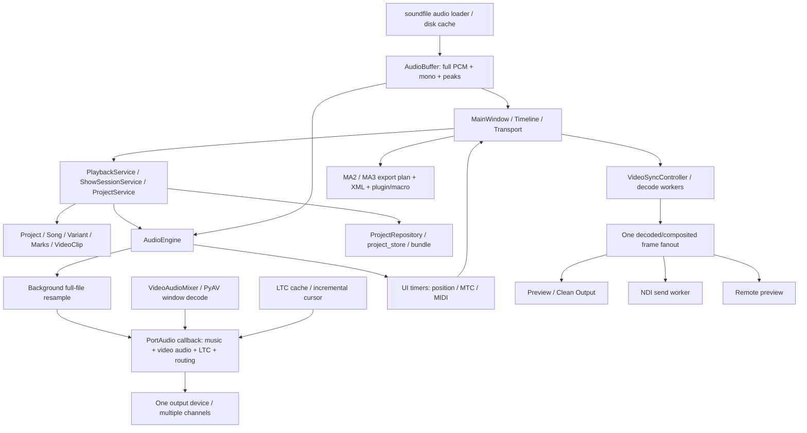
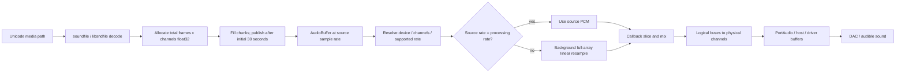
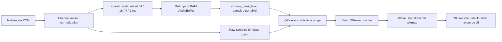
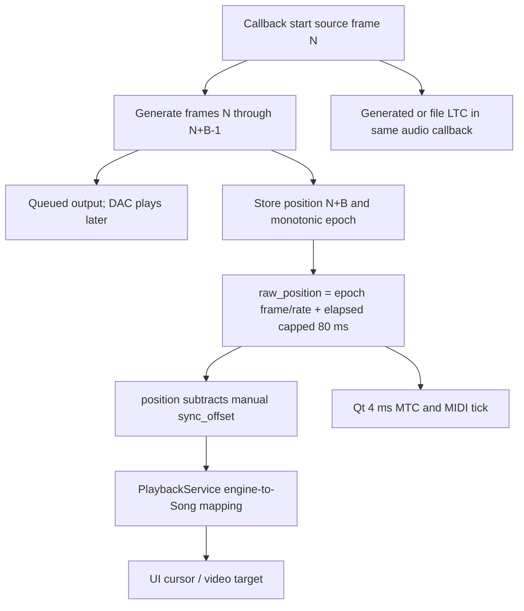
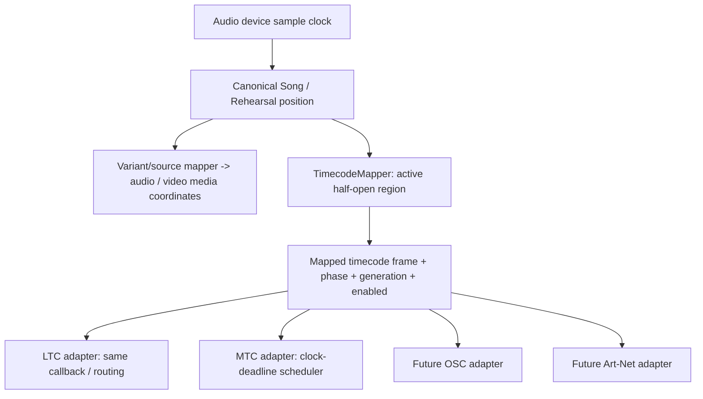

# CuePlayer 技術稽核：0815 基線

日期：2026-09-05。對象：`d9663ec9b955d76417a5bdcb6751deb105b382f3`，版本 1.1.3。

本次只新增分析、證據及獨立重現工具，**沒有修改正式播放、UI、專案格式或 exporter**。以下行號指這個基線；函式名稱與 code path 是後續版本較可靠的定位方式。

## 1. 結論、版本與證據界線

Git fetch 後確認，使用者說的 0815 版本位於 `origin/codex/fix-from-1.1.1`，最後提交是 2026-08-15 19:52:49 +0800 的「Add recoverable unused media cleanup」。本機原本的 `master` 是較舊的 `f7653c9`。本次從 0815 建立 `cursor/technical-audit-0815-028d`；沒有覆蓋 master 或原修正分支。

最重要的發現：

1. **游標讀取的是已送入輸出 buffer 的位置，並非正在 DAC 播出的 sample。** Callback 丟棄 `time_info`，更新 block 結尾後再以 monotonic 外推。這是確定的 clock 語意錯誤，能解釋「游標先經過鼓點，聲音稍後才到」的方向；使用者機器上的誤差量仍須量測。
2. **一般跨取樣率有重取樣，不是全部直接把 44.1k PCM 當成 48k。** 但 stream 開啟失敗改用其他 rate 時，engine、video mixer、LTC cache、位置與 stream token 更新不一致，已用假 stream 重現。這是 ASIO 偶發問題的重要候選，尚未證明就是使用者那次人聲變調的原因。
3. **Zoom 先拉伸舊 QPixmap，再延遲重畫，確實存在。** 此外一般音訊已經有多解析度 peaks，但 level selector 選錯方向，縮小時仍常選最細資料。不是單純「還沒做 mipmap」。
4. **長音檔仍全量配置 PCM；漸進讀取不等於 streaming playback。** 3 小時、48k、stereo float32 單一 PCM 約 4.15 GB，尚未加 mono、LTC、重取樣與其他歌曲 cache。目前不適合直接承諾 3 小時排練模式。
5. **另有短 Loop、多媒體波形批次漏資料、fractional FPS 換算、MTC Loop、NDI 關閉鎖與非原子存檔等問題。** 應分小步修正，不需要整個 rewrite。

證據用語：

- **已確認／重現**：目前程式路徑可直接證明，或本次獨立程式產生可重現結果。模擬 stream 的結果不代表實機 ASIO 已重現。
- **高度疑似**：已找到符合症狀的路徑，但缺使用者當時的 device、rate、buffer、檔案與 trace。
- **潛在**：有明確觸發條件與機制，尚未量到事故或發生率。

範圍包含 `src/` 全部 157 個 Python 檔案的 AST 清冊（67,308 行）、產品／架構文件、相依設定與測試，並追查各子系統的呼叫、資料與 timing flow。這不是宣稱每一行都經形式驗證：大型 UI 的每個 dialog、第三方 native library、實機 console、每種 codec／driver 組合仍有覆蓋限制。清冊和重現資料見 [證據目錄](docs/audit/2026-09-05/README.md)。

## 2. 目前架構圖

好的既有設計值得保留：Domain、Playback、Media、Exporters、Persistence 已分包；有 ports、application service、generation token、video latest-target 控制、video audio window、波形背景程序與 disk cache。Preview／Clean／NDI 共用 frame fanout，沒有發現為 NDI 另啟一個獨立推進時間的影片 player。

實際邊界尚未完全符合目標圖：MainWindow 仍同時協調載入、cache、video、routing、存檔及 remote；application 有具體 Qt／engine 相依；可變 `Song` 被 UI、mixer、video 等共享。問題是狀態與執行緒所有權不明確，不是檔案大本身。不要為拆檔而拆檔。

## 3. Audio Playback Flow

主要位置：`media/audio_loader.py:174 load_audio`；`ui/main_window.py:6442` 附近載入／cache 路徑；`playback/audio_engine.py:875 set_buffer`、`:920` deferred completion、`:1028 play`、`:1380 _resolve_device_and_route`、`:1697 _refresh_playback_samples`、`:1896 _make_stream_callback`。

一般 audio waveform 與 playback **共享 soundfile 解碼出的 AudioBuffer**。沒有證據顯示一般 WAV／MP3／FLAC 用兩個不同 decoder 分別給聲音與 waveform。Video embedded audio 則使用 PyAV：mixer 的 window decode 與 waveform artifact 的 sequential decode 是不同路徑，PTS、trim、batch continuity 必須另外驗證。

正常資料單位：`samples.shape[0]` 是多聲道 audio frame 數，不是乘上 channels 後的 scalar 數。來源時間應為 `source_frame / source_rate`，輸出 frame 則除 `playback_rate`。一般 `seek` 在 `audio_engine.py:1164` 以 `round(seconds * playback_rate)` 定位；一般 waveform 以 source rate 換算 bucket。**沒有找到所有 44.1k 檔案都固定按 48k 算時間的普遍錯誤。**

但以下改變會破壞原本成立的關係：rate fallback 未同步發布狀態、已配置但尚未填滿的 PCM 被當成完整來源、variant anchor 的兩套時間域，以及未計入輸出排隊時間的游標。

Play 之前可能在 UI 等待 `_wait_for_resampled_music_ready`（`:976`，future timeout 120 秒）；Stop／Seek 改變後續 callback 讀取位置，不會撤回已提交給 driver 的舊 block。Pause 保留 stream 並輸出靜音。這些行為需在測試中區分「指令收到」、「新 sample 已排隊」、「新 sample 已聽到」。

## 4. Waveform Flow 與 Zoom

一般音訊：

定位：`audio_loader.py:55 _minmax_buckets`、`:67 build_peak_pyramid`、`:117 choose_peak_level`；`timeline_widget.py:2153 set_zoom`、`:2229` transform preview、`:2278` finish、`:2858 _blit_zoom_preview`、`:2990` cache rebuild、`:5692` waveform paint、`:6012` peak paint、`:6086` raw paint。

**已重現的 selector 問題**：48k 的 levels 為 3072／768／192／48 samples。samples-per-pixel = 192、768、3072、480000 時，實際均選 48。反向巡訪與提前 return 使最細層先命中；極近 zoom 則 fallback 到粗層，部分 raw 分支會掩蓋此結果。既有 pyramid 應先修 selector 及其邊界測試，不要再加一套重複架構。

**Zoom 外觀原因已確認**：33 ms preview 節流約 30 Hz，view notification 約 66 ms，280 ms idle 後重建。期間 `drawPixmap` 把舊畫面伸縮，線條寬度、bucket 細節與 pixel sampling 一起改變，所以出現模糊／變形，之後恢復。不是每次滾輪都重新 decode；重畫本身仍在 UI。

其他已確認資料問題：

- `_minmax_buckets` 向下取整，尾端不足一個 bucket 被丟棄；48,001-frame 測試只在最後一個 sample 放脈衝，所有 peak levels 最大值都是 0。
- Stereo 先平均為 mono，左右反相的可聽訊號可完全消失於 waveform；測試 `[+1,-1]` 得到 0。應保留每 channel peaks 或用包絡聯集，不宜用相位相加代表可聽能量。
- Normalization 讓圖形不代表絕對振幅；不是 timing bug，但比較版本音量時可能誤導。
- 一般 waveform 沒有套用 variant `anchor_offset`，而 Timeline cursor 經 `engine_to_song_time`。有非零 anchor 的專案可能產生固定差；目前 experimental align UI 關閉不代表持久化 offset 永遠為零。
- Peak painter 部分區間邊界使用 floor，需測試跨 pixel／bucket 的單一 transient，避免漏畫邊界 bucket。

Video waveform 已有更進一步架構：`media/video_waveform_artifact.py` 使用 bounded base bins（4000 bins/s、上限約 2M）及多層聚合，8 秒 batch、progressive coverage、disk artifact，Windows 預設隔離 process（`:927 _use_isolated_waveform_process`）。3 小時上限換算約 185 bins/s，約 5.4 ms 的 base resolution；不能宣稱長影片仍有 sample-level waveform。

**影片波形批次漏資料已實際重現**：`:653 SequentialWaveformDecoder.read_batch` 對超出 batch 的 samples 截斷卻沒有 carry；遇到下一區間 frame 也可能消耗 iterator 後 break，沒有保留該 frame。本次 25 秒、48k WAV 經此 PyAV 路徑，回傳 `[0,8)`、`[8.021333,16.021333)`、`[16.042667,24.042667)`、`[24.064,25)`，三個 21.333 ms 缺口。這證明 decoder batch coverage 缺陷；最終 UI 缺口外觀取決於 artifact coverage 補掃策略，不能直接宣稱音訊播放也漏掉同樣資料。

改善建議：採用現有 peaks，修正層級選擇、尾端與 channel 語意；以 viewport 所需 pixel columns 直接 aggregate min/max，pixel cache 使用 tiles／有限 overscan，滾輪時保留同一時間座標且直接讀相鄰 level，不伸縮舊振幅圖。UI 只組裝可見 tiles；背景產生純資料或 QImage，QPixmap 留 GUI thread。Cache key 包含檔案指紋、schema、channel/excluded LTC、rate、level、tile、DPR／樣式；未 ready 區域與真靜音必須分開。

**目前不需要先導入 GPU。** 正確 LOD、bounded cache、viewport 聚合能先去掉大量 CPU 工作；量到 paint 本身仍超預算再考慮 scene graph／GPU。不得為 Zoom 問題先換整套 UI framework。

## 5. Timing / Clock Flow

`audio_engine.py:513 raw_position`、`:536 position`、`:1197 _mtc_tick`、`:1204 _emit_position`、`:1939` callback 位置推進、`:2035` epoch 更新。`output_latency_seconds`（`:509`）回傳的是設定 offset，不能當作 driver 實測 latency。

PortAudio `outputBufferDacTime` 是本 block 第一個 sample 預計抵達 DAC 的時間；與 `currentTime` 同一時間基準。[PortAudio callback time 定義](https://files.portaudio.com/docs/v19-doxydocs/structPaStreamCallbackTimeInfo.html)。目前 callback `del time_info`，沒有把這個資訊用於 presentation clock。

本次假 callback：48k、480 frames（10 ms），currentTime=100、first-sample DAC time=100.03；callback 後程式已報位置 0.010 s。若穩態沿用這個排程，游標相對真正輸出約領先 **30 ms 排隊 + 10 ms block = 40 ms**。這是模型重現，不是量到使用者音效卡固定 40 ms。Driver、host mixing、安全 buffer、DAC、外接 DSP／擴大機／聲音傳播與顯示刷新可能再增加差異；不應拿 40 ms 寫死補償。

目前並非四個完全獨立播放 clock：music 與 LTC 共用 callback；video 的目標來自 engine。真正問題是 **render/write head 與 presentation head 混用**、UI 計時器 dispatch、silent fallback 的 timer 累加、remote monitor 的獨立 pacing。

Silent 模式 `audio_engine.py:1233` 每次 timeout 固定加 `0.016 * rate`。UI 卡住漏掉 tick 時不補實際 elapsed，會慢於 wall clock。Qt timeout 過期只補送一次，不補發所有 tick。[Qt QTimer 文件](https://doc.qt.io/qt-6/qtimer.html)。如果需要可靠的無音樂 timecode，仍應使用同一硬體 audio stream 產生 LTC／silence；非硬體預覽 fallback 應明確標示並依 monotonic epoch 計算，不應數 timer 次數。

### 建議 Master Clock Architecture

保留 AudioEngine 為唯一 transport clock owner，增加明確的 immutable `ClockSnapshot`，不另造 Timeline clock：

- `stream_epoch`／`transport_generation`：Play、Seek、Loop discontinuity、rate/device restart 的識別。
- `output_frame_start`、`frame_count`、`actual_stream_rate`：輸出 block 的物理 sample 座標。
- `song_position_at_block_start`、`transport_state`、必要的 block 內 segments：邏輯 Song／rehearsal 時間。
- `dac_time_first_sample`、`host_time_observed`、timestamp validity：輸出 presentation 定位。

給 render 的 frame 與給顯示的 audible position 分開命名。有效 timestamp 下，以 DAC 對應的 sample 計算當下可聽位置，限制在已提交且同一 generation 的 interval；Pause／Seek／Loop 不能跨 epoch 直線外推。時間基準使用 PortAudio stream time 或明確校準過的 monotonic bridge，不能直接假設兩者 epoch 一樣。

Generated LTC 在同一輸出 sample 座標生成；Timeline／video 讀 presentation snapshot；MTC／MIDI scheduler 從相同 snapshot 定 deadline，獨立於 UI dispatch。Video 可以丟過時 frame，不能反過來推動 clock。Remote listening 的 network jitter buffer 另標為監聽延遲，不回授演出 clock。

Reported latency 可能只涵蓋部分 host／driver 路徑；requested low latency 也不是實際總延遲。必須保留 timestamp validity 與 loopback 校準證據，而不是把任何欄位当完整物理聲學延遲。[PortAudio buffering / latency 指南](https://github.com/PortAudio/portaudio/wiki/BufferingLatencyAndTimingImplementationGuidelines)。

## 6. Threading Model 與 callback 工作

主要執行域：

- **GUI thread**：MainWindow、Timeline QPainter／QPixmap、transport、位置 16 ms timer、MTC/MIDI 4 ms timer、silent timer、存檔／bundle、部分 cache restore 和波形重建、device negotiation／stream start-stop，以及等待 resample future。
- **PortAudio callback thread**：engine lock 下讀 PCM、組 music/video/LTC、routing、多聲道 outdata，更新 position。不能依賴 GUI thread 及時跑才填得出音訊。
- **Python background pools**：audio loading／prefetch、resample、LTC full PCM、LTC detect、video audio decode。Native numpy/PyAV 是否釋放 GIL 視操作而定，放 thread 不等於沒有 UI／callback 競爭。
- **Video decode workers**：scrub／playback request、generation／ack／watchdog，輸出回 GUI fanout。`av_path_lock` 以 path 串行化 native media 操作。
- **Video waveform process（Windows 預設）**：隔離 PyAV／GIL，批次回傳 coverage；仍會消耗 CPU／磁碟與 IPC。
- **NDI worker**：latest frame 發送，有 config lock 與 join 問題。
- **Remote HTTP threads / asyncio WebRTC**：狀態讀取、monitor PCM、命令排入 GUI queue。

Callback 目前不是嚴格 realtime-safe：`audio_engine.py:1896` 全段混音持 engine lock，配置 numpy arrays、mix buses、slice／concatenate；`VideoAudioMixer.chunk_at:978` 會掃 clips 並計算 overlap，`_record_event:253` 建 dict/dataclass 並拿事件 lock。沒有看見 callback 直接常態寫檔，但不可把一般 `perf` logger 加到 callback。

callback broad exception 會填靜音，缺少能追查是哪個例外／哪個 block 的 bounded diagnostics；這使「突然沒聲音」難以區分 underrun、decode 未 ready、routing、exception。Existing underflow fallback 的 bit 判讀與 variable block callback period 統計也需校正；不要以現有零計數直接保證沒有 dropout。

建議 control plane 在非 RT thread 建不可變 render plan，callback 只讀 snapshot、填預先配置 scratch、進行 bounded mixing。對 callback 只記固定容量、預先配置的數字 ring／counter，由其他 thread 批次匯出。先量 lock wait、GIL、allocation 與 deadline，必要時才移少數 DSP／scheduler 到 native code；不要全域關 GC 作為第一修法。

## 7. 已確認問題與嚴重度

嚴重度按現場影響：Critical＝可能破壞專案或使演出核心失效；High＝可造成錯 timecode／無聲／明顯卡頓；Medium＝特定條件品質／可靠性缺陷；Low＝可觀測性／維護問題。**嚴重度不代表已在使用者現場發生；下列都有自己的證據等級。**

### C01 — 非原子專案存檔與媒體搬移交易缺口（Critical，程式事實；未做斷電破壞測試）

`persistence/project_store.py:1115 save_project` 直接 `Path.write_text` 覆寫 JSON。`main_window.py:2675 _autosave_tick → :3031 _file_save` 的 bundle／layout 工作同步執行，backup 失敗可能只警告；media path／檔案位置改變與 JSON commit 不是一個可恢復交易。若 crash／磁碟滿／程式被終止，可能留下截斷 JSON 或舊 JSON 指向已搬走位置。既有 backup 與 stale-path healing 降低風險，但不等於 atomic save。

建議先做同目錄 temp、flush、原子 replace、上一版回復；媒體採 copy/verify/commit/cleanup 或 journal，失敗保留原有效專案。風險：Windows 檔案鎖、跨磁碟與 AV；需 fault injection、Unicode、磁碟滿與 restore tests。不要先修改現有使用者媒體。

### H01 — Write head 被當成 audible playhead（High，程式＋模擬重現）

位置見第 5 節。直接影響 waveform／cursor／video 的可聽對齊。修正風險是 Pause／Seek、manual offset 相容及使用者依舊 clock 建立的校準。先收 trace，不把既有 offset 偷偷疊加第二次。

### H02 — Rate fallback 非原子更新（High，假 stream 重現）

`audio_engine.py:2093 _open_output_stream`、`:2147 _start_stream` 先 open/start，再只更新 engine rate 和 music resample。原 48k 改以 96k 成功後：engine=96k、mixer=48k、active token=48k；480,000 frame 原代表 10 秒變 5 秒；原 LTC PCM 未清。這不是模擬 driver「偷偷改 rate」，而是程式自己已知 fallback rate 卻未同步狀態。

影響包括位置跳變、video audio 速度／位置異常、LTC 波形速率錯誤、stream 重開判斷不一致。音樂 resample 本身另有更新，故不能說此 probe 已證明主音樂一定升調。建議所有 rate-dependent state 以同一 generation prepare/publish；stream 啟動前先建立一致 plan。風險高，需 mock start callback race 與實機測試。

### H03 — Progressive full PCM 被當成全部 ready（High，程式路徑確認）

`audio_loader.load_audio` 先配置整檔 zeros，初段約 30 秒後發布，之後繼續寫入；AudioBuffer 沒有精確 valid-frame intervals。Seek 到未填區域可讀到「假靜音」，rate mismatch 的整檔 resample 也可能把當時未填區域固化為零。`audio_engine.py:947 rebind_buffer_samples` 完成後重建且可等待，播放途中有空窗風險。

建議 ready ranges／generation，render 只能消費已 ready blocks；seek 預先 pre-roll，缺資料可觀測而非當真靜音。風險：切歌、取消、舊 future 完成後誤發布；必須測慢磁碟／短檔／長檔不同 rate。

### H04 — 長音檔與跨歌曲 RAM 無上限（High，配置與 cache 路徑確認）

`audio_loader.py` 全 PCM；`audio_disk_cache.py:111 load_cached_waveform_peaks` 讀完整 mono 並配置整長 PCM placeholder；`main_window.py:6562 store_audio_cache`／`:7606 _prefetch_all_setlist_audio` 無 bounded RAM policy；`video_audio_cache.py:18 _cache` 持有所有 native decoded windows。Mixer 本地最多 8 windows，**不會自動釋放外層共享 cache 的相同 PCM**。

建議 byte-budget LRU、當前／下一首 pin、取消非必要 prefetch，長檔 bounded streaming；不可只縮 mixer window 就宣稱 leak 修好。風險是 cache eviction 與 callback ownership，必須用 snapshot reference 生命周期保護。

### H05 — 小於 callback 的 Loop 只處理一次 wrap（High，重現）

`audio_engine.py:2256`、`:2273`、`:2285` loop chunk helpers。480-frame Loop、1024-frame callback 預期 next frame=64，實際=544；sample 1000 也不是 loop sample 40。另 callback 直接來源 channel routing 未共用 loop assembly，與 music／LTC helper 可不一致。

應依剩餘 block 分段重複 wrap，next 用 modulo；在相同 sample segments 上混所有 buses。風險：crossfade、LTC discontinuity、短 loop CPU；需 1 sample、B-1、B、B+1、跨多圈與任意 routing 測試。

### H06 — MTC／MIDI 依 GUI timer，Loop 與停頓不可靠（High，部分重現）

`audio_engine.py:1197 _mtc_tick`、`playback/mtc_output.py` 的 tick 以 quarter-frame index 往前補送。模擬 10 秒→2 秒→3 秒，未 reset 時 QF 不再送出直到超過舊 index。Callback 先 wrap，UI `_maybe_wrap_loop` 常看不到 B 邊界，所以不能保證觸發 MTC reset。Seek full-frame 路徑存在，但自然 Loop 不等同 Seek。

GUI 停頓後 MTC catch-up loop 可一次補發大量過期 QF；MIDI cue notes 在同 timer 扫 marks，嚴格 `prev < t <= pos` 邊界及回跳會漏／重送特定 marks。MIDI 用 raw engine time，非零 variant anchor 時還有座標問題。

建議共享 clock 的獨立 scheduler，generation discontinuity 明確 reset、full-frame／QF 重錨，過期 QF 不 burst replay。風險：接收器有 rate/lock 差異，不能用發出 byte 的單測替代接收器驗證。

### H07 — Fractional FPS 雙向換算不互逆，DF 只有部分表示（High，重現）

`timecode/smpte.py seconds_to_timecode / timecode_to_seconds`，`timecode/ltc.py`，`timecode/mtc.py`。29.97 輸入 3600 秒變 `00:59:56:12`，parse 回 3596.4004004 秒；23.976 變 `00:59:56:10`，回 3596.417 秒。24／25／30 在此測試互逆。

NDF 在 fractional rate 一小時的 label 不等 wall-clock 一小時，本身合理；**錯的是 formatter 按 frame count，而 parser 按 HH/MM/SS 真秒，兩者語意不同。** 分號被換成冒號、LTC DF flag 不等於完整 skipped-label 演算法。不能宣稱現有任意 29.97／23.976／DF 都精確。

建議 rational rate＋integer frame ordinal，NDF/DF label 明確獨立；舊專案 migration 必須保留原意並提示歧義，避免一改 converter 把全部 MA cue 移動。

### H08 — UI 上仍有重工作與 blocking waits（High，程式確認；未量整體 GUI p95）

`audio_engine.py:976` resample wait、`:1380` device probe、`:2297` stop/close；`main_window.py:6549 _waveform_for_timeline`／`:7085 _apply_timeline_ltc_lane` 可重建全 mono/peaks；`timeline_widget.py:2990` 靜態 cache rebuild；save/bundle/cache restore 在 UI。

背景 decode 已存在，所以不能說所有 decode 都在 UI；真正瓶頸是完成後的全量衍生計算、同步 cache 還原、future 等待与 native 設備操作。建議先量最慢 span 再挪工作，完成事件只發布結果。風險：generation／取消／Qt object ownership。

### H09 — NDI stop/config lock 與 worker join 順序（High，鎖路徑確認；未重現 native crash）

`playback/ndi_output.py:445 close` 拿 `_cfg_lock` 後 `:462 _stop_worker_locked` join 最多 5 秒；worker `:499 _send_one` 也要拿同鎖。若 worker 已準備進 `_send_one`，close 持鎖等待它結束，會撞 timeout；之後還可能關 sender／重啟並 clear 共用 stop event。若 native send 正持鎖卡死，UI 連 join 前的 lock 都拿不到，5 秒上限無效。

改為發 stop→鎖外 join→确认退出→close/reconfigure，sender 所有權限定 worker。風險：native async frame buffer 生命周期；不能 timeout 後就安全假設可以 destroy。

### H10 — App 關閉缺完整 engine/video worker teardown（High，呼叫鏈確認）

`main_window.py:5013 _shutdown_secondary_windows` 停 transport、關部分輸出，未見完整 engine stream／executor shutdown；`video_sync.py:4232 shutdown` 已有但未接到主關閉流程。風險是 native stream 殘留、背景 future 阻止程序退出、完成訊號投向已釋放 QObject。需從 app lifecycle 建單一 shutdown protocol；不得把本次 pytest access violation 直接歸因於此。

### H11 — Variant 的 Song time / media time 沒有贯穿所有消费者（High，條件式程式事實）

`application/playback_service.py:230 song_to_engine_time`／`:236 engine_to_song_time`；`domain/anchor_mapping.py` 定義 `song = variant + offset`。UI cursor 在 `main_window.py:5272` 映射，但 waveform native origin、engine 內 generated LTC、MIDI、video-audio mixer 並未全部使用同一 Song domain。非零 offset 專案可能圖、聲、timecode、影片聲與畫面不同步。

現有 experimental UI flag 限制觸發面，不消除持久化資料／其他路徑。修法先加 time-domain contract tests，再在小接縫補全 mapping；不要直接把現有 offset 刪掉。

### M01 — Waveform LOD、stretch、尾端與反相消失（Medium，重現／程式確認）

見第 4 節。修正不應改变 audio samples；主要風險是 cache schema 與像素邊界回歸。以合成 transient、反相 stereo、多 rate、DPR 1/1.5/2 比對。

### M02 — Video waveform batch coverage 缺口（Medium，實際 PyAV 重現）

見第 4 節。以 pending frame／PCM carry 保留批次剩餘資料，且 PTS 正規化不能偷偷把真間隙壓縮掉。測 PCM、AAC、MP3 embedded、非零 PTS、VFR video audio、seek/resume batch。

### M03 — Linear resampler 缺 anti-alias filter（Medium，訊號重現）

`playback/resample.py:10 resample_linear` 使用 `np.interp`。96k 的 30k tone 降到 48k，出現 18k alias，RMS 約 0.519。這是音質問題，不等於整段聲音的 sample-rate pitch mismatch。`resample_linear_yielding` 分段處理還需驗證邊界連續性。改用 stateful band-limited resampler，保留 fractional phase、已知 group delay 與 flush 語意；LTC 檔案邊緣不能盲用音樂濾波設定。

### M04 — Video mixer 每 callback 掃全部 clips（Medium，microbenchmark）

`video_audio_mixer.py:978 chunk_at`、`domain/models.py:993 overlapping_video_clip_ids` 每次處理全部 clip／排序，即使都不在目前時間。這台機器 50 次測試：0 clips median 0.0008 ms；100 clips 0.0588 ms；1000 clips 0.6486 ms、p95 0.7381 ms。48k／64-frame 的整個 callback deadline 僅 1.333 ms，尚未加 music/LTC/routing/GIL。

這是離線函式成本，不是實際音效卡 callback benchmark。建議預先 interval index／active render set；overlap 目前相鄰比較對巢狀重疊也需補測（長 A 包住短 B/C）。

### M05 — Cache 指紋／失敗永久快取／重複 I/O（Medium，程式風險）

`audio_disk_cache.py` waveform npz 含完整 mono；cold completion 有重複存 cache 的路徑；採用舊 cache 的 donor 判定對 size／mtime／舊路徑過度信任，需防同大小／保留 mtime 的內容替換。`video_audio_cache.py:48 get_video_audio` 把 decode failure `None` 留在共享 cache，暫時失敗可能持續無聲。磁碟 cache 有容量 pruning，不能當 RAM 已有限制的證據。

建議 schema/version＋可靠 file identity、原子 temp write、per-key single-flight、失敗 TTL／明確 retry。風險：首次升級 cache miss 造成大量重建，應 lazy migration。

### M06 — Remote 命令 timeout 不會取消排隊命令（Medium，程式確認）

`web_remote/bridge.py:595 _enqueue_command` 等 reply 5 秒，`:603 _drain_commands` 在 GUI 分批執行；queue 無界限。GUI 卡頓後，客戶端以為失敗並重試，舊 Play／Seek／其他命令可能仍稍後執行。加 deadline、request id、去重與 bounded queue。監聽 `_mon_cursor` 自行 pacing 且落後超過約 0.45 秒才重錨，故 remote audio 不是 sample-accurate 演出輸出；不能拿它驗證本機 DAC sync。

### M07 — 測試基線無法全綠（Medium，實跑）

完整 pytest collection 因舊 waveform API import 中止；強制繼續後發生 Windows native access violation，未取得完整 summary。核心 subset 有 1 fail，focused 有 2 fail。需先修 isolation／釐清 stale test 與真正 regression，才能安全推進 rate／clock 修改。詳見第 14 節。

### L01 — 文件／診斷與現在實作不同步（Low，確認）

部分架構文件仍描述早期未含 NDI 的狀態，與 0815 版已有多層 video worker 不一致。現有 `diagnostics/perf.py` 明文禁止 RT callback 呼叫，方向正確，但缺 DAC／rate-generation 與 silence reason 資料。更新特定契約即可，不需要先重寫所有文件。

## 8. 高度疑似原因與尚未確認的潛在問題

**音樂波形比聲音早**：H01 是最直接且已確認的機制；若差值隨 buffer／device 改變，更支持輸出排隊時間。若只有特定 variant 固定偏移，查 H11。若偏差持續線性累積，查 effective rate／clock domain；若只在 MP3 開頭，查 codec priming／padding；若只在 embedded video audio，查 PTS／M02。不得先補一個萬用 offset。

**ASIO 人聲突然變調**：H02 為高優先候選；driver 實際 rate 與 requested／reported rate 不一致則仍是硬體假設。目前未取得 Focusrite 控制面板／ASIO driver trace，也未捕捉變調當下。Buffer underrun 通常是破音／斷裂，不足以直接解釋持續而均勻的音高比例改變；應量 tone frequency 與播放 duration。

其他需專項驗證：

- `_ensure_stream` 主要看 object／token，未完整以 active/stopped 偵測拔除重接。失效 stream 可能仍被視為可用；fallback 到系統 default／縮減 channels 也可能讓演出 LTC 路由消失。建議顯示 fault 並保留使用者指定 routing，勿無提示改送其他裝置。
- `_open_output_stream` 若建立成功但 start 失敗，清引用前是否確實 close native resource，需要 fake start-failure 及反覆 restart leak test。
- 混不同解析度／aspect 影片 crossfade 時，`video_sync.py` composite arrays 的 shape 相容性要測；不能只用同尺寸 fixture 推論所有影片正常。
- `media/video_audio_loader.py` 的 PTS／stream start、AAC priming、window seek trim，以及同 path `av_path_lock` 長時間 native decode 對 scrub 延遲；watchdog 若只能在 native call 返回後檢查，不能保證硬 timeout。
- `Song` 原地修改與 callback／remote 讀取沒有完整 snapshot contract。需以編輯／undo／換歌壓力測試找 inconsistent view，不能僅因 GIL 就宣稱安全。
- Unused Media 的 resolve containment、Unicode 與 recoverable quarantine 是正面設計；保護範圍是目前 Project 引用，未包含別的 JSON 專案或 undo history 引用同 Media 的情境。需在 UI 範圍說明／恢復演練中驗證，不把它誤稱永久刪除。
- LTC incremental seek 的 bit phase／接收器 relock、25 fps parity 實機相容性、最後不完整 frame、檔案 LTC 重取樣後 edge 品質，都需獨立 decoder／接收器；本次未確認 parity 缺陷。
- NDI native send／teardown、MIDI backend message 接受型別、ASIO channel mapping、長時間 Python/native memory 都沒有完整實機證據。列為測試項，不宣稱已發生 crash。

MA2／MA3 路徑已檢查 export plan、XML、assign/import 輔助物與 fixtures。Main mark Go+ explicit CueDestination、Top Button 2-cue self-release、MA2 plugin assign before timecode、MA3 macro sequence→assign→timecode、timecode-only re-export 與 ASCII export names 必須保留。本次 exporter subset 通過不等於已在所有 desk software 版本 import；fractional FPS 與未來 Region export 仍須 console round trip。

OSC 目前主要是 MA3 pool scan／整合工具，MA2 是 telnet 類設定；沒有可拿來保證「通用 OSC timecode realtime scheduler」的完整現成功能。Art-Net Timecode 也應視為未來 adapter，不把規劃當已實作。

## 9. Sample Rate / ASIO 專項分析

正常路徑是 source native PCM → `resolve_output_samplerate`（`playback/devices.py:645` 附近）probe 可支援 rate → `_playback_rate` → music resample → callback。裝置預設 48k 不代表程式一定選 48k：若 44.1k probe 接受，可能開 44.1k；不接受才選其他候選。ASIO control panel／實際 sample clock 必須與實際 opened stream 一起記錄。

目前設定 `latency='low'`、`blocksize=0` 讓 host 選 callback 大小，並嘗試其他 latency/rate/channel 變體。沒有完整的「open 後驗證 actual samplerate／latency、同步發布所有 rate-dependent objects、確認 stream active」交易。`check_output_settings` 只是可開啟性檢查，不是保證實體 oscillator 的測量。[sounddevice stream API](https://python-sounddevice.readthedocs.io/en/latest/api/streams.html)、[ASIO settings API](https://python-sounddevice.readthedocs.io/en/latest/api/platform-specific-settings.html)。

本次 2 秒 1 kHz 訊號，44.1→48、48→48、48→96、96→48 的現有 music resampler 都得到 2 秒／1 kHz（FFT 解析度 0.5 Hz）。這排除了「這些簡單正常路徑必然變調」；不涵蓋 driver、fallback race、progressive readiness 或所有訊號音質。

若實際把 44.1k samples 以 48k 播，頻率比例 1.088435，約 +146.7 cents、duration 變短；反向約 -146.7 cents；48k 當 96k 播是 octave。錄音量到這類整齊比例才更支持 rate mismatch。偶發聲道缺失／相位／混音也可能讓人聲音色異常，但不應把音色變化直接當音高改變。

最小修正設計：

1. `RequestedDeviceConfig` 與 `OpenedStreamConfig` 分開，後者包含 device identity、host API、channels、requested/stream-reported rate、latency、callback frames 範圍、generation。
2. prepare 新 music source/resampler、video mixer rate、LTC cursor/cache key、routing 和 position rebase；不能在 callback 已跑後分次換 rate。
3. 停舊 stream／取消舊 jobs，提交完整一致 snapshot，再啟動。不同 sample rate 時保留邏輯秒數，不能保留舊 frame 整數直接換除數。
4. stream-reported rate 不符時明確處理；若 driver 隱瞞則以 loopback 查證，不聲稱 software 能保證不誠實 driver。
5. runtime active/error 偵測、bounded recovery；拔除／重接與 fallback routing 要可見。不能悄悄失去 LTC channel 卻仍显示健康。

必測：開 Project 第一次 Play、Pause→Play、Stop→Play、Seek 中間、Loop、切 Song／Variant、改 routing、改 rate、ASIO panel 先開／後開、其他 app 佔用、start fail、device disconnect/reconnect。每次比較五者：source rate、processing rate、stream reported rate、hardware panel、captured effective rate。

## 10. 效能與長音檔架構

3 小時 stereo float32 **單 PCM** 的實際算式為 `10800 * rate * 2 * 4` bytes：44.1k = 3,810,240,000；48k = 4,147,200,000；96k = 8,294,400,000（十進位 GB 約 3.81／4.15／8.29）。Mono／generated LTC 各再增加一半；48k PCM＋mono＋LTC 就約 8.29 GB，未含 peaks、暫存、其他 songs 與 video。

44.1→48 還保留來源 PCM 與 destination PCM，`np.interp` 的 float64 時間軸／中間陣列可再增加數 GB。這是配置推算，不是本次實際載入 3 小時量到的 RSS；lazy allocation／paging 會改變觀測峰值，但不改變無界架構風險。

Waveform raster 並不是整首歌寬的巨大 bitmap：目前有 viewport／overscan cache，值得保留。問題在錯 LOD、full-height layers、兩份 pixmap、DPR² 記憶體、重建在 GUI。一般 idle overscan 約 3.5 個 viewport 寬，playback 約 128px；長時間縮到 overview 仍可能掃大量 finest peaks。

建議分兩步，避免過度工程：

- **先設上限**：main audio／video shared cache 統一 byte budget、LRU、active pin；只預載下一首，停止全 setlist 無界預載；取消舊 generation。Waveform sidecar 只含 peaks＋metadata，不含 full mono／placeholder PCM。先得到可量的 RAM plateau。
- **再加入長媒體 backend**：保持短檔 in-memory 快路；長檔使用一個 decoder owner、bounded source blocks、stateful resampler、output ring，依 seek generation 丟舊資料。Callback 不做檔案 I/O、不等 decoder。獨立背景順序掃描生成 disk multiresolution peaks，chunked lazy read；deep zoom 只讀可見 raw PCM window。

已有 video window decode／waveform artifact 可借鑑，但不可直接複製它的共享 cache 無界與 batch carry 問題。Generated LTC 不需要整首 PCM；已有 incremental cursor 可在測過 sample/bit continuity 後成常規路徑，full cache 至多 bounded blocks。

實際操作優先：Play 不同步重算整檔；Seek 使用取消／最新目標／pre-roll；scroll/zoom/drag 每次只處理可見資料；marker 拖動把重排／持久化留 commit，預覽避免全層 invalidate；video lag 丟旧 frame，不阻塞 Timeline；NDI slow consumer 不积压 frames。對 autosave、BPM、LTC detect、waveform、prefetch 設 playback-aware CPU／I/O budget，不靠提高全部 thread priority 競爭。

## 11. Theatre / Rehearsal Mode 提案

### 11.1 相容性與時間域

保留普通「一首歌＝一個 Song／多個 audio versions／一組 timecode」workflow。額外 `timeline_mode = song | rehearsal`，舊檔缺欄位時預設 song。不可用把長錄音切成好多實體 Song 複製 PCM 來假裝完成需求。

Domain 新增 `TimecodeRegion`、`TimecodeMapper`，不命名 LTCRegionManager。至少包含 stable id、Unicode Display Name、Rehearsal Start/End、timecode origin（整數 frame ordinal＋label mode）、rational FPS、enabled、routing profile reference。MA Export Name 仍另存 ASCII；非 LTC 協定不必理解聲道號，routing profile 是 adapter-specific 設定。

現有 engine 座標是 variant time，PlaybackService 才映射 Song time，不能忽略這點。過渡期在明確接縫建立 canonical Song position，先補 H11 的一致性；後續才考慮讓 engine transport 自身採 canonical 座標。不能直接在 UI 計算 LTC label 再用 signal 餵 callback。

普通 Song 可由 mapper 產生一個 implicit region，保持原 Song start timecode／FPS。Rehearsal 使用 explicit regions，**不在任何 enabled region 時預設 LTC 靜音**。已錄製於檔案的 LTC 是音訊內容，改 metadata 不會把它重新編時；該模式應選 generated LTC 或明確區分 pass-through，不能聲稱兩者都自動 region remap。

### 11.2 Mapping 與邊界

Region 採 `[start,end)`，預設禁止 overlap，排序後驗證有限值、end>start、id 唯一、路由可用。disabled region 不穿透回普通 Song implicit timecode。可相鄰，無空隙；邊界落在 block 中間時依 sample 切 block，不等下一個 UI tick。

概念公式：`mapped_elapsed = rehearsal_position - region.start`；`timecode_frame = region.origin_frame + floor(mapped_elapsed * fps_num / fps_den)`，保留 subframe/sample phase。實作以整數／有理數計算避免每 tick 累加 float，定義秒→sample 的 rounding 與 end boundary。Label 不是可以直接相加的秒字串。

使用者範例：Song A `[750,1020)` 秒，origin `01:00:00:00`；位置 800 秒映射到 A 的第 50 秒。Song B 從 1420 秒開始，origin `02:00:00:00`。這個文字加法對整數 FPS 很直觀；fractional NDF 的 wall elapsed 與 label elapsed 必須透過 frame conversion，不能用 HH:MM:SS 真秒拼接。

FPS 支援 24000/1001、24、25、30000/1001、30 的 rational value；區分 nominal label rate。29.97 DF 以 frame ordinal 轉 label，略過每分鐘 00/01、每十分鐘例外；跨小時／24h／非法 label 都測。23.976 沒有通用的 29.97-style DF，應拒絕不支援組合。MTC rate code 不能原生唯一標識 23.976，需明確 adapter capability／receiver policy，不能偷偷 round 成 24 後宣稱等價。

### 11.3 Transport 行為

- **Seek／拖到中段／Jump Marker**：原子更新 transport generation 與 region lookup；取消舊音訊／timecode scheduler 事件。LTC 從新位置重建 phase；接收器可能需要重新鎖定。MTC 發 full-frame 定位後重錨 QF，不補送舊時間。
- **Loop／A-B Loop**：依 callback 的同一分段表定位 Region；同一 block 可經過 region end、silence、另一 region、loop wrap。每次 discontinuity 有 event，即使 UI 完全沒看見 B。
- **Pause**：預設音訊/LTC 停；MTC 可保留最後定位但不繼續 QF。Resume 從相同邏輯位置重新啟動並遵守 relock policy。
- **無 Region**：LTC silence 為預設。LTC 沒有通用「Stop packet」；freeze label 重複送不等於停止，freewheel 是繼續前進。若提供 freewheel/freeze，作為明確獨立選項並註明接收器語意。
- **FPS／routing 切換**：由同一 device 上的新 render segment 套用，不開第二個 audio device、不假設 LTC 是 Left/Right。不同 FPS 的接收器要重新 lock，不能保證零間隙。
- **Frame discontinuity**：任意 sample seek 可能截斷 LTC word。需在「立即跳轉並允許 relock」與「靜音至合法 frame 起點」中定 policy；把引入的最多一 frame 與接收器 relock 分開量測，不能偷加固定音樂 offset 掩蓋。

### 11.4 UI、Persistence、Export

新增獨立 timecode-region lane，保留絕對 rehearsal ruler；選取 region 時展示 local timecode ruler／Inspector。Song／mark／variant 不改成 region 的子物件以免破壞現有排序；可選的 region_id 用於操作與 export，mark 的 canonical position 仍為絕對時間。Region edits 用 command/undo，播放中只發布完整 validated snapshot。

JSON 加 schema migration，old projects round-trip 不變；存 id/rational rate/DF/routing reference，不存不必要的逐 sample mapping。Region boundaries、invalid routes、重疊與缺失媒體做 preflight。一般模式 UI 保持原有 workflow。

MA export 要新增「Region-aware export plan」：每 region 以自己的 TC origin 對應 region 內 marks，維持 stable CueDestination／executor assignment。不同 region 重複 timecode／重用 sequence 的衝突需明確提示；不能直接把整條錄音絕對秒數丟進舊 exporter。Full export／timecode-only re-export 都必須保留 MA2 plugin、MA3 macro 順序與 Top Button 2-cue 習慣。

先交付 pure mapper＋tests，再 adapter integration，再 UI/persistence，再 console round-trip。長檔 backend 至少達可用 RAM 上限後，才可宣稱 Theatre 功能適用 2–3 小時檔案。

## 12. 建議修改順序與風險

各 Phase 是後續工作提案；**本次沒有執行 production diagnostics 或任何 Phase 的行為修改**。每個 phase 拆成小 PR，完成 regression 才進下一個，不把 clock 修正與整套 UI rewrite 混在一起。

### Phase 0 — 可重現基線與 diagnostics

修復 stale test imports、隔離真實 device/native teardown；保存使用者實際 build 的 Python／DLL／driver versions。新增 bounded callback trace、rate/stream generation、ready intervals、silence reason、UI/event-loop lag、cache bytes、video target/PTS／NDI queue 指標。沿用 `diagnostics/perf.py` 做非 RT spans。

完成條件：同一事件能串起 source frame→render block→DAC timestamp→cursor/video target；測試不會意外開真硬體；所有現有失敗被修復或有逐項已知原因。風險低至中：logging 本身可干擾 timing，必須比較 diagnostics on/off。

### Phase 1 — Rate transaction 與 clock 語意

先 H02 讓 engine/mixer/LTC/token 同 rate，再 H01 presentation clock、H11 time-domain contract；補 driver active、start-failure cleanup。保持 music/file-LTC/channel routing 與正常 Song workflow。

完成條件：rate fallback mock、source/device matrix、seek/pause/loop epoch 全過；實機 loopback 能拆出 buffer latency 與剩餘差。風險高：影響所有播放；小範圍契約修正、保留 rollback，不先導入 streaming rewrite。

### Phase 2 — 演出可靠性缺口

優先獨立修 C01 atomic save；H05 loop segmentation、H06 MTC/MIDI scheduler/discontinuity、H09 NDI lock order、H10 teardown，各自 PR。LTC continuous cursor 與 fractional FPS/DF semantic tests 先補齊，舊資料換算變更需 migration 計畫。

完成條件：fault injection 可回復專案；超短 loop 任意 bus 正確；阻塞 UI 不停止 MTC scheduler；重開／關閉無殘留 native/thread resource。風險中至高：接收器相容、存檔交易與 native ownership。

### Phase 3 — Waveform 與 cache 小修

修 selector/tail/stereo envelope、video batch carry、停止 stretch preview、限定 viewport／tile 工作量；main waveform sidecar 脫離 full mono/PCM；byte-budget cache。先不改音訊輸出 samples。

完成條件：transient 峰不漏，zoom/scroll 畫面穩定，UI frame time 與 RAM 有上限。風險中：舊 cache 失效、DPR／顏色／LTC exclusion／variant offset。

### Phase 4 — 長檔播放與 UI 工作移出

引入長媒體 bounded decode/ring、stateful resampler、valid ranges、取消與 pre-roll；短檔保留現有快路。移除 UI full-file wait／peaks 重建、全 setlist prefetch，mixer 使用 active interval render plan。Video decode lock contention 以量測結果局部處理。

完成條件：3 小時音檔/影片 RAM plateau、任意 seek 不讀假靜音、playback 不受 waveform/prefetch 吞吐影響。風險高：這才是較大型播放架構變更，需要事前說明與獨立驗收，不能和 Phase 1 混做。

### Phase 5 — Theatre / Timecode Regions

先 pure mapper、rational timecode、implicit normal Song compatibility；再 LTC/MTC、UI／undo／persistence、MA region export。OSC／Art-Net 作 adapter 擴充，不能以「未來支援」當成本次驗收成功。

完成條件：使用者例子、任意 seek、跨 region/loop、silence gaps、mixed FPS capabilities、old project round-trip 與 MA desk test。風險中至高：frame discontinuity、舊 label 歧義、routing／export identity。

### Phase 6 — 長時間可靠性與 release gate

8–12 小時 stress/soak，至少包含 3 小時素材；device/driver matrix、NDI／remote slow consumer、autosave、磁碟滿／拔除、重開 100 次、演出前 recovery rehearsal。測試其實從 Phase 0 開始累積，最後才完整 soak，不能最後才第一次測硬體。

完成條件：零未解釋 crash／deadlock／dropout，cache/RSS 穩定，timing 不累積軟體誤差，有可恢復專案與故障提示。風險主要是環境覆蓋不足；未測的 driver/build 不能宣稱保證。

## 13. 可實際執行的 timing 測試與誤差標準

### 合成素材與矩陣

產生 Unicode 路徑的 click track：0、1、2、3 秒各有已知 sample onset，另有單 sample impulse 及較易聽／cross-correlate 的短 click；增 1 kHz tone 測速度/pitch。0 秒 click 可能受起播 gate／硬體 ramp 影響，不能只測起點。長版在 1／10／30／60／120／180 分鐘放標記，保存原始 sample index manifest。

- WAV、FLAC：44.1／48／96 kHz，mono/stereo/multichannel，含 LTC 在非 L/R channel。
- MP3：44.1／48 kHz、CBR/VBR、不同 encoder／gapless metadata。標準 MPEG MP3 不原生支援 96k，本次 encoder 明確拒絕；96k device 測試應用 44.1/48k MP3 重取樣，不偽造 96k MP3 matrix。
- Device：44.1→48、48→48、48→96，另加 96→48、44.1→44.1、96→96；ASIO／WASAPI supported combinations。固定與 host-auto blocksize，64／128／256／512／1024 支援範圍內測。
- 操作：first play、stop/resume、seek 正反、拖曳、marker jump、short/multiwrap loop、切歌／variant／device、拔除重接、rate panel 切換、慢硬碟與未 ready seek。

### 分層測法

1. **Pure software**：source sample/seconds、resample duration/frequency、peak bucket coverage、timecode frame round-trip、region boundary，固定 seed、無 audio device。
2. **Fake callback**：給定 currentTime/DAC time、variable blocksize、start/fallback failure、underflow、generation；檢查 render/write/presentation positions 不混淆。
3. **同機硬體 loopback**：同一 capture interface 同時錄 music out 與 LTC out 到不同 inputs；用 cross-correlation 找 click、獨立 LTC decoder 找 frame/phase，兩者共享 capture clock。保留 route/sample rate/buffer trace。不可把播放程式自己的 LTC decoder 作唯一真值。
4. **畫面對物理輸出**：記錄 cursor 对应的 presentation snapshot/time、QPaint completion；用高幀率相機（至少 240 fps）或 photodiode＋同一 capture clock 觀察實際螢幕與音訊。GUI log 不等於螢幕已亮；ADC/display/線材/DSP 路徑分別列 uncertainty，不用猜測 offset 相消。
5. **接收端**：MA2／MA3／MTC receiver 真正 lock、jump、loop，記錄收端 latency／容忍度；電氣 LTC sample alignment 和接收器解碼反應是兩種數據。

### 建議驗收門檻（提案，非本次達成值）

- Sample/time／seek target／region mapping：整數 frame rate-domain 轉換 ≤1 output sample；rational 運算不得隨播放時長累積額外誤差。
- Peak onset 覆蓋：onset 必須落在對應 min/max bucket；顯示定位誤差上限為選定 bucket duration＋1 pixel 的時間，不對粗 zoom 要求 sample-level 外觀。
- Presentation clock：timestamp 有效時，軟體推算與 DAC sample schedule 誤差目標 ≤1 ms；driver timestamp 不準時必須標記，轉為實測可達範圍，不虛報精度。
- 實際 Audio↔Timeline 畫面：60 Hz 顯示單一 refresh 就 16.7 ms，不能承諾所有畫面瞬間 <10 ms。先目標 p95 ≤25 ms、p99 ≤40 ms、無固定額外 buffer 領先；高刷新環境再驗證更嚴格值。軟體位置誤差與物理 panel 誤差分開列。
- Music↔generated LTC：共同輸出 sample schedule 目標 ≤1 sample；接收器 frame label 的判定誤差另以 ≤1 TC frame（排除已說明固定解碼延遲）衡量。Seek／FPS jump relock 初始目標 2–5 frames，依實機規格調整，不能要求任意 jump 零 relock。
- Pitch／duration：數位輸出 sample count 正確；1k tone 偏差以量測 resolution＋硬體 ppm 為界，初始 loopback 目標 <0.01% 並記 capture-clock 校準。不容許 44.1/48 比例型誤差。
- Drift：同一 hardware clock 下的 software audio/LTC 相對 phase 不應逐時增加；UI presentation 殘差不呈線性成長。與另一台未同步 oscillator 比較要另列 ppm（20 ppm 一小時就 72 ms），不能當作單機 software drift。
- Realtime：在宣告支援負載下零 output underflow；callback p99 < block duration 的 50% 作初始預算，保留 OS jitter headroom。記 max 及 underrun，平均值不能掩蓋 dropout。
- 操作：warm Play/Stop command dispatch p95 <20 ms、warm seek 新 block ready p95 <100 ms；實際 audible response 加上量到的 queue latency。Cold codec seek 另訂門檻，不能用 warm benchmark 宣稱全部即時。
- UI：正常播放/drag/scroll 目標 60 Hz，paint/update p95 <16.7 ms；長素材載入仍可操作。RSS/cache 8 小時應 plateau，無每圈／每次切歌單調增加；以實際 byte budget 評估，不訂任意所有機器一致 RAM 數字。

每筆輸出保存 build SHA、deps/DLL、CPU/OS、device/driver、sample rates、actual block sizes、路由、檔案 hash、GUI refresh/DPR、diagnostics on/off、warm/cold cache 與測試操作；沒有這些條件的「差 10 ms」不可作根因證據。

## 14. 本次已執行測試與限制

原 `.venv` 指向已不存在的 Python。已用本機 Python 3.13.14 重建並安裝專案 dev dependencies；**這不是使用者 0815 打包 EXE 的確切環境**。本次 NumPy 2.5.2、soundfile 0.14.0、sounddevice 0.5.6、PySide6 6.11.2、PyAV 17.1.0、pytest 9.1.1，完整 freeze 存在證據目錄。

實跑結果：

- 全套 `pytest -q`：collection error，`tests/media/test_video_clip_waveform.py:11` import 已移除的 `build_clip_waveform_data`，未進入完整測試。
- `--continue-on-collection-errors`：執行中出現 Windows fatal access violation，process 非零退出且無完整 summary。保存 raw log；未取得 native dump，不能把它認定為 ASIO／NDI／某個 app 缺陷 root cause。
- Domain／Persistence／Exporters／Routing／Timecode／Application／Ports／Repository／Core／Unicode：**464 passed、1 failed**，7.68 秒。失敗是 `test_video_clip_create_clamps_degenerate_values` 預期負 start clamp 成 0，現模型保留 -5；需依負起點產品語意決定 test 是否過時，不為測試綠燈任意改模型。
- resample／resample_hold／devices／midi_cue_notes／audio_loader／audio_disk_cache／video_waveform_artifact：**79 passed、2 failed**，2.14 秒。兩項 device test 預期 mock Focusrite index 1/3、實際 None；未完整 mock native stream 開啟，不能代表本機真的有／壞了 Focusrite，也不能當純硬體無關測試。需補 isolation 後再判定 regression。
- 獨立 [audit_0815_probes.py](scripts/audit_0815_probes.py)：不開硬體 stream、不連網；重現 clock、fallback、loop、peaks、MTC、FPS、aliasing、PyAV batch gaps，輸出 JSON。這是 baseline characterization，不是把錯誤結果寫成應永遠成立的產品測試。
- 合成 WAV／FLAC 44.1/48/96k，4 秒 click 最大峰位置與原 sample 一致；本環境 MP3 44.1/48k 峰位偏差約 -0.023 至 +0.136 ms。MP3 的 lossy pulse 形狀／峰偏移不能全解釋為 decoder delay；這組 fixture 也不能排除其他 encoder metadata 的 delay。
- Resample tone／mixer microbenchmark／長檔記憶體配置推算：結果見前節與 probes JSON。沒有做 3 小時實際檔案 RAM soak、GUI 真實 frame timing、Focusrite ASIO loopback、MIDI接收器／NDI／MA desk 端到端測量。

因此本次不是「所有測試通過」或「已保證 pitch 正確」的 release certification。測試缺口與已找到的程式缺陷都需保留，不能以 543 個 subset passed 抹掉失敗和 native crash。

## 15. 下一步的最小可執行工作

建議下一個任務只做 **Phase 0：修復測試隔離與加入 bounded audio timing/sample-rate diagnostics，不改播放行為**。把本次已重現的問題轉成正確期望的 regression tests，再在實機重現「游標早／ASIO 變調」收同一份 trace。

取得證據後優先修 rate transaction 與 presentation clock；C01 atomic save 可以獨立較小 PR 提前處理。Theatre mapper 可先設計 pure domain tests，但不要在長檔資源與 clock 契約尚未成立前直接推出大型 UI 功能。全程維持 Unicode、多版本比較、單一輸出裝置任意 channels、sample-locked video 與 MA export 的既有非協商需求。
