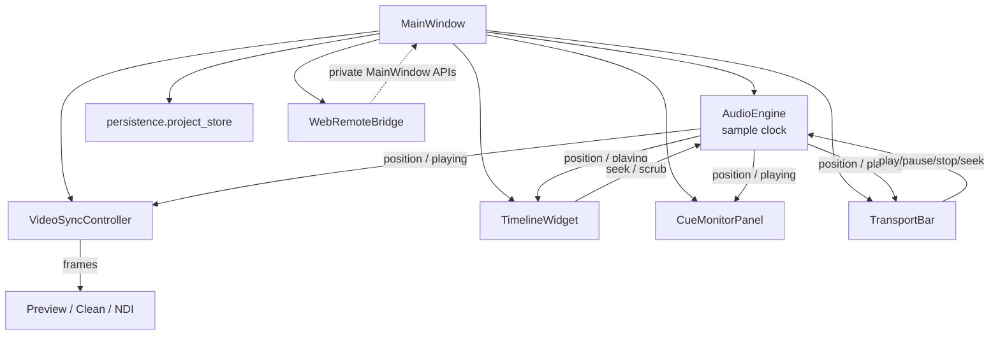
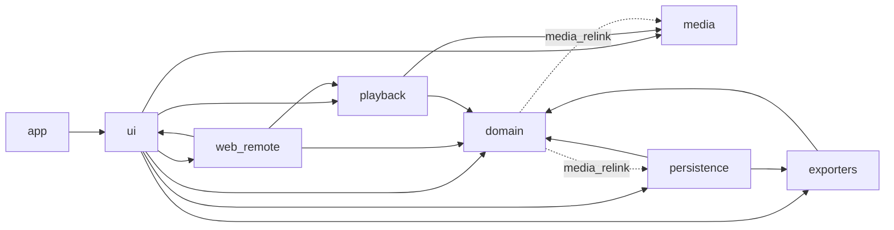
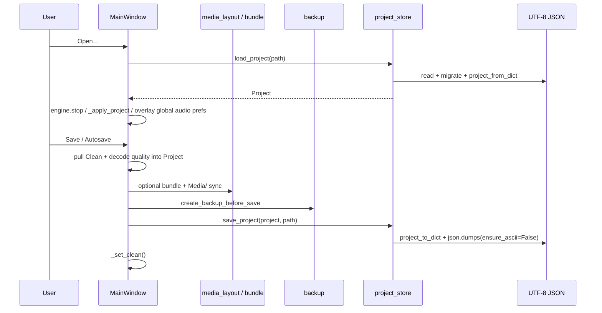
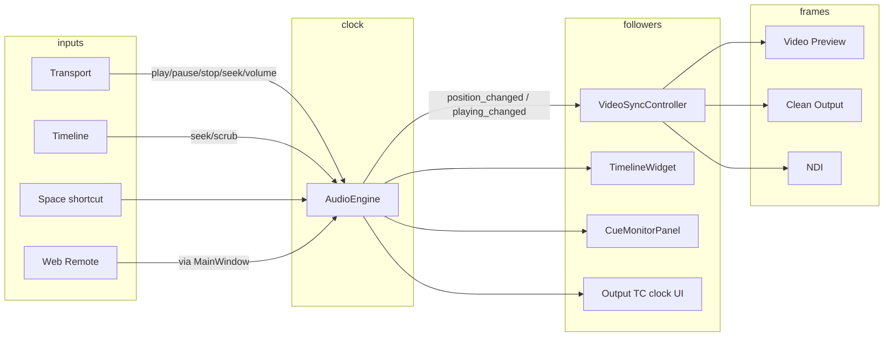

# CuePlayer — Current Architecture Assessment

**Status:** Sprint 1 · Task 1 (assessment only)  
**Date:** 2026-08-03  
**Scope tip:** `cursor/sprint1-architecture-assessment-028d` (stacked on Sprint 0 retrospective / columns-migrate line)  
**Constraint:** Inspect + document only — **no** moves, renames, new packages, or behavior changes.

Related docs (do not treat as identical):

| Doc | Role |
|-----|------|
| [`ARCHITECTURE.md`](ARCHITECTURE.md) | Short aspirational layer diagram |
| [`ARCHITECTURE_REVIEW.md`](ARCHITECTURE_REVIEW.md) | Earlier as-built review (ZH); still useful, partially stale on `persistence→ui` / `ports` |
| [`ARCHITECTURE_TARGET.md`](ARCHITECTURE_TARGET.md) | Strangler target layout |
| [`BOUNDARY_RULES.md`](BOUNDARY_RULES.md) / [`MIGRATION_RULES.md`](MIGRATION_RULES.md) | Permanent law |
| [`SPRINT_0_REVIEW.md`](SPRINT_0_REVIEW.md) | Foundation retrospective |
| **This file** | English **Sprint 1 baseline** snapshot of the repo *as checked out today* |

---

## 1. Current folder structure

```text
CuePlayer_didido/
├── AGENTS.md / README.md / pyproject.toml
├── .ai/                    # AI workflow: NEXT_TASK, REPORT, handoffs, prompts
├── .cursor/rules/          # auto-push, ai-workflow
├── docs/                   # architecture + product + distribution manuals
├── fixtures/               # MA2/MA3 golden XML, media, export fixtures
├── packaging/              # Windows PyInstaller / Inno (Windows-only builds)
├── scripts/
├── tests/                  # ~mirrors packages; ui tests dominate
└── src/cueplayer/          # ~107 .py, ~44.3k LOC
    ├── app.py              # QApplication boot + MainWindow
    ├── __main__.py         # python -m cueplayer
    ├── domain/             # models, undo, cue id, columns, media_relink
    ├── playback/           # AudioEngine (clock), video sync/mix, devices, NDI, MTC/MIDI
    ├── media/              # decode, caches, BPM, LTC detect, av_path_lock
    ├── persistence/        # JSON project, bundle, backup, media layout, audio prefs
    ├── exporters/          # ma2/, ma3/, plan, show_patch, XML helpers
    ├── ui/                 # ~53% LOC — MainWindow hub + widgets/dialogs
    ├── web_remote/         # HTTP/WS server, bridge, static app.js
    ├── timecode/           # SMPTE / LTC / MTC helpers
    ├── routing/            # channel matrix
    ├── util/               # frozen runtime, thread priority
    ├── spikes/             # early experiments
    ├── ports/              # ⚠ SOURCE MISSING on this tip (only __pycache__)
    ├── timeline/           # empty stub (__init__.py only)
    └── ltc/                # empty stub (__init__.py only)
```

### LOC by package (approx., `.py` only)

| Package | LOC | Notes |
|---------|----:|-------|
| `ui/` | ~23.6k | Dominant; god-object `main_window` |
| `playback/` | ~5.8k | Clock + video audio + devices |
| `media/` | ~3.5k | Decode / caches / BPM |
| `web_remote/` | ~3.3k | Plus `static/app.js` ~3316 lines |
| `exporters/` | ~2.4k | Cleanest layer |
| `domain/` | ~2.2k | |
| `persistence/` | ~2.2k | |
| `timecode/` / others | small | |
| `ports/` / `timeline/` / `ltc/` | 0 source | stubs or missing |

---

## 2. Main entry points

| Entry | Path | Behavior |
|-------|------|----------|
| Module | `python -m cueplayer` → `__main__.py` | Calls `app.main()` |
| Package | `cueplayer.app:main` | Boot log, Qt app, splash, `MainWindow` |
| CLI side door | `cueplayer --bpm-detect …` | Headless BPM worker **before** full UI boot |
| Frozen EXE | Same `app.main` via packaging | Windows employee builds only |

Boot sequence (simplified):

```text
__main__ → app.main()
  ├─ [--bpm-detect] → media.bpm_analyzer.run_bpm_detect_cli → exit
  └─ QApplication + splash
        └─ MainWindow()          # composition root of nearly everything
              ├─ Project / Song
              ├─ AudioEngine
              ├─ VideoSyncController
              ├─ Timeline / Monitor / Transport / Setlist …
              └─ optional Web Remote bridge
```

There is **no** separate `application/` package yet. Composition and use-cases live inside `MainWindow`.

---

## 3. Major modules and their responsibilities

| Module | Intended job | As-built reality |
|--------|--------------|------------------|
| **domain** | Pure Project/Song/Mark rules | Mostly correct; `media_relink` reaches into media + persistence |
| **playback** | Sole sample clock + device I/O + TC outs + video audio mix | `AudioEngine` is wide; `clock.py` is a legacy wall-clock stub, not the master clock |
| **media** | Decode, waveform/PCM caches, BPM, LTC detect, PyAV lock | Clear; `av_path_lock` is a cross-cutting runtime contract |
| **persistence** | UTF-8 JSON + migrations + bundle/backup | Functional; still depends on exporters naming + (lazy) playback device default |
| **exporters** | Song → MA2/MA3 | Clean; UI constructs exporters directly |
| **ui** | Widgets | Also project lifecycle, media jobs, remote host, autosave orchestration |
| **web_remote** | LAN control | Package-local server/state; `bridge` duck-types `MainWindow` private APIs |
| **timecode / routing / util** | Helpers | Small and coherent |
| **ports** | Protocol seams (Sprint 0 Step 0) | Designed on architecture branch; **not present as `.py` on this tip** |
| **timeline/ / ltc/** | Early scaffold | Empty — real UI/timeline + LTC live under `ui/` and `timecode/`/`media/` |

### Runtime composition (as wired today)



---

## 4. Current dependency graph

Static first-party imports (package → package), measured on this tip:

```text
(root)/app     → ui, media, util
ui             → domain, exporters, media, persistence, playback, util, web_remote
web_remote     → domain, media, persistence, playback, timecode, ui, util
playback       → domain, media, routing, timecode, util
media          → domain, util
persistence    → domain, exporters, media, playback   (audio_prefs → devices default)
exporters      → domain
routing        → domain
domain         → media, persistence                   (media_relink only)
spikes         → routing
```



### Boundary status vs `BOUNDARY_RULES.md`

| Edge | Status on this tip |
|------|--------------------|
| `persistence → ui` | **Cleared** (Sprint 0): uses `domain.cue_list_columns` |
| `domain → media/persistence` | Still present via `domain.media_relink` |
| `web_remote → MainWindow` privates | Still present (duck-typed; no hard import of `main_window`) |
| `ports` package | Missing source — cannot `import cueplayer.ports` cleanly for Step 2 |

Non-UI importers of `cueplayer.ui.*`: only `app` (boot) and `web_remote.dialog` (`ui.checkbox`).

---

## 5. Largest files (top 10 by size)

By **line count** (`.py` / notable JS). Byte size order is the same for the giants.

| # | Lines | Path |
|--:|------:|------|
| 1 | 7637 | `ui/main_window.py` |
| 2 | 4507 | `ui/timeline_widget.py` |
| 3 | 3316 | `web_remote/static/app.js` |
| 4 | 2688 | `ui/cue_monitor_panel.py` |
| 5 | 2146 | `playback/audio_engine.py` |
| 6 | 1338 | `web_remote/bridge.py` |
| 7 | 1323 | `ui/mark_manager_dialog.py` |
| 8 | 1080 | `domain/models.py` |
| 9 | 989 | `media/bpm_analyzer.py` |
| 10 | 870 | `persistence/project_store.py` |

Honorable mentions: `setlist_sheet_page.py` (~819), `show_patch_page.py` (~737), `transport_bar.py` (~734), `web_remote/state.py` (~780).

---

## 6. Which files contain business logic mixed with UI

Not every domain import in UI is a smell (binding models to widgets is normal). The problem is **orchestration / rules / side effects** living in widgets.

| File | Mixed responsibilities (examples) |
|------|-----------------------------------|
| **`ui/main_window.py`** | Open/save/autosave/bundle/relink; song activate + audio prefetch; BPM/LTC job scheduling; undo push; MA name sync; setlist renumber; Clean/NDI toggles; Web Remote host; dirty tracking |
| **`ui/timeline_widget.py`** | Paint + zoom/scroll + mark/clip edit gestures + scrub + waveform cache ownership + cue-id helpers |
| **`ui/cue_monitor_panel.py`** | Cue table UX + column prefs + NOW chrome + renumber menu wiring + note/id edits |
| **`ui/setlist_sheet_page.py`** | Sheet UX + mutates `song.ma_export_name` via exporter naming rules |
| **`ui/song_edit_dialog.py`** | Form UX + MA export name suggestion |
| **`ui/mark_manager_dialog.py`** | Lane CRUD UI + `sync_lane_cue_ids` |
| **`ui/show_patch_page.py`** | Export plan UI + MA sanitize |
| **`ui/missing_media_dialog.py`** | Relink UX over domain `media_relink` (acceptable thin; domain still impure) |
| **`web_remote/bridge.py`** | Not Qt widgets, but **application service** duplicated against MainWindow private surface |

Pure-ish UI (theme, checkbox, icon button, spinboxes, row_color) is comparatively clean.

---

## 7. Circular imports (if any)

### Package-level

No hard package cycles such as `playback ↔ ui`. Soft/forbidden-ish edges: `domain → media/persistence`, `web_remote → ui` (dialog only).

### Module-level

| Pair | Nature |
|------|--------|
| `domain.models` ↔ `domain.main_cue_id` | **Real soft cycle:** `main_cue_id` imports models; `Song` methods lazily import `main_cue_id` inside methods. Works at runtime; awkward for typing/tools. |
| `timecode` package `__init__` ↔ `timecode.ltc` / `mtc` | Benign re-export pattern (submodules import `smpte`, package imports submodules). |
| `playback.audio_engine` → `midi_cue_notes` | One-way only (false positive if treating attribute names as imports). |

**Verdict:** No import-time deadlock found in normal UI boot. The only worth-tracking cycle is **models ↔ main_cue_id**.

---

## 8. Global state usage

CuePlayer avoids classic process-wide singletons for `Project` / `Song`, but has several **process-scoped** stores:

| Mechanism | Where | Role |
|-----------|-------|------|
| **`av_path_lock` registry** | `media/av_lock.py` (`_locks` dict) | Per-resolved-path `RLock` for PyAV; shared by preview, scrub, waveform, mixer, stand-in |
| **QSettings (`CuePlayer`/`CuePlayer`)** | `MainWindow`, `audio_prefs`, `web_remote/prefs`, `color_presets` | Machine-global prefs (autosave, audio device, UI session, remote, colors) |
| **Disk audio cache** | `media/audio_disk_cache` (+ MainWindow in-memory maps) | Cross-song PCM/waveform reuse |
| **Thread pools / tokens** | `MainWindow` | Load/BPM/LTC generation counters (`_audio_load_token`, `_song_activate_gen`, …) |
| **Shared mutable `Song` / `Project`** | Engine, video_sync, timeline, monitor, remote | Not a Python `global`, but **shared object identity** is the real global state |

There is no DI container; `MainWindow` owns references.

---

## 9. Existing models

Primary home: `domain/models.py` (+ helpers in sibling modules).

| Type / area | Location | Notes |
|-------------|----------|-------|
| `Project` | `models.py` | Setlist, songs, categories, audio/clean/MA settings, UI chrome prefs persisted in JSON |
| `Song` | `models.py` | Timebase, audio tracks, video clips, mark lanes, LTC sides, BPM, setlist fields |
| `AudioTrack`, `VideoClip`, `Mark`, `MarkLane` | `models.py` | Core timeline entities |
| `SetlistCategory` | `models.py` | Folders |
| `MaExportSettings`, `AudioOutputSettings`, `CleanVideoOutputSettings` | `models.py` | Nested settings objects |
| Cue list column constants | `domain/cue_list_columns.py` | Migrated Sprint 0; UI shim re-exports |
| Cue ID rules | `domain/main_cue_id.py` | Assign/renumber/sort |
| Undo commands | `domain/undo.py` | Command objects over Project/Song |
| Relink scan helpers | `domain/media_relink.py` | Domain-named but reaches media/persistence |

Schema version constant lives with models (`SCHEMA_VERSION`); migrations live in `persistence/project_store.py`.

---

## 10. Existing services

**There is no `application/` or `*Service` class layer yet.**

De-facto services (by behavior, not by name):

| De-facto service | Current home |
|------------------|--------------|
| Project open/save/save-as/dirty/autosave/bundle | `MainWindow` + `persistence.*` |
| Song session (activate song, refresh UI/engine/sync) | `MainWindow._activate_song` |
| Media job queue (audio load, BPM, LTC detect) | `MainWindow` ThreadPoolExecutors |
| Video output fan-out (Preview/Clean/NDI) | `MainWindow` + `VideoSyncController` + NDI helper |
| Export orchestration | UI dialogs + `exporters/*` |
| Remote command surface | `web_remote.bridge.WebRemoteBridge` |
| Playback clock / mix | `playback.audio_engine.AudioEngine` |
| Frame clock follower | `playback.video_sync.VideoSyncController` |

Target names in `ARCHITECTURE_TARGET.md` (`project_service`, `song_session`, …) are **aspirational**.

---

## 11. Existing repositories

**No repository pattern / classes.** Persistence is function-oriented:

| API | Module | Role |
|-----|--------|------|
| `load_project` / `save_project` | `persistence/project_store.py` | JSON ↔ `Project` + migrations |
| `project_to_dict` / `project_from_dict` | same | Serialization core |
| `collect_project_bundle` | `persistence/project_bundle.py` | Bundle export |
| `create_backup_before_save` | `persistence/backup.py` | Rolling backups |
| media layout / path helpers | `media_layout.py`, `media_paths.py` | Media/ folder arrangement |
| `load_global_audio_output` / `save_global_audio_output` | `audio_prefs.py` | Machine audio prefs via QSettings |
| mark template lanes | `mark_template.py` | Lane dict helpers |

Ports define a future `ProjectStore` Protocol on the architecture branch; not wired here.

---

## 12. Current save/load flow



Notes:

- Dirty flag `_dirty` is owned by `MainWindow` (not domain).
- Autosave: QTimer + QSettings interval; quiet `_file_save`.
- Load path also used by “Collect Bundle” then reopen bundled JSON.
- Missing media: after open, relink dialog via `domain.media_relink.scan_missing_media`.
- Machine audio prefs from QSettings **overlay** project JSON on apply (`apply_global_audio_to_project`).

---

## 13. Current playback flow



Rules in force:

- **`AudioEngine.position` (sample-based) is the only playback clock.**
- Video windows share one decode path through `VideoSyncController` (not a second player).
- Song switch: `quiesce_output` → swap `current_song` → `set_song` on timeline/monitor/sync/engine → async audio load under `av_path_lock` discipline.
- Embedded video audio mixes in `VideoAudioMixer` inside/ beside the engine path.

---

## 14. Current settings flow

Settings are split across **three stores**:

```text
┌─────────────────────────────┐
│ Project JSON (per show)     │  marks, songs, MA export, clean geometry,
│ persistence.project_store   │  decode quality, many chrome flags, etc.
└─────────────┬───────────────┘
              │ load overlays ↓
┌─────────────▼───────────────┐
│ QSettings CuePlayer/CuePlayer│
│ • audio/output_settings_json │  ← audio_prefs (wins over project on apply)
│ • autosave/*                 │  ← MainWindow
│ • UI session / monitor cols  │  ← MainWindow / cue monitor
│ • web remote prefs           │  ← web_remote.prefs
│ • color dialog presets       │  ← color_presets
└─────────────────────────────┘
              │
┌─────────────▼───────────────┐
│ Live widgets                 │
│ Audio Timecode dialog,       │
│ Transport, Clean window, …   │
│ mutate Project and/or QSettings
└─────────────────────────────┘
```

Implication for future `application` services: must know **which knobs are machine-global vs project-local** or saves will regress employee machines.

---

## 15. Technical debt (prioritized)

### P0 — Blocks safe Sprint 1 moves

1. **Split architecture vs release tips** — `ports/` `.py` sources exist on `cursor/ports-package-step0-028d` but not on this migrate tip (pycache only). Step 2 RemoteHost cannot start until tips unify.
2. **`ui.cue_list_columns` shim still live** — callers (e.g. cue monitor) still import UI path; delete only after retarget.
3. **Doc overlap / stale claims** — `ARCHITECTURE_REVIEW` still mentions `persistence→ui`; `PRODUCT_SPEC` status can mislead agents.

### P1 — Structural risk (product-visible)

4. **`MainWindow` god-object (~7.6k)** — composition + use-cases; every feature PR grows the hub.
5. **Shared mutable `Song`** — missed refresh → A/V or list desync.
6. **`av_path_lock` contention** — preview/scrub/waveform/mixer share path locks; perf/crash surface.
7. **`WebRemoteBridge` ↔ MainWindow private API** — rename/`_` churn breaks remote; no `RemoteHost` port yet on tip.
8. **`AudioEngine` breadth** — device + routing + LTC/MTC/MIDI + video audio in one type.

### P2 — Layering / maintainability

9. **`domain.media_relink` → media/persistence** — violates target domain purity.
10. **`persistence` → `exporters.common` naming** — storage coupled to MA sanitize rules.
11. **`models` ↔ `main_cue_id` soft cycle**.
12. **Empty `timeline/` / `ltc/` stubs** — confuse navigators.
13. **Giant UI files** (`timeline_widget`, `cue_monitor_panel`) — hard to test/review; split later, not first.
14. **No named application services / repositories** — behavior exists but is undiscoverable for agents.

### P3 — Deferred (do not mix into early Sprint 1)

15. Full `adapters/` tree rename of playback/media.
16. Rewriting `AudioEngine` / timeline paint architecture.
17. Product features (NDI polish, Align Anchors, etc.) under an “architecture” banner.

---

## Documentation merge / simplify notes

Sprint 1 should **not** delete history blindly, but can reduce agent confusion:

| Action | Recommendation |
|--------|----------------|
| Keep **this file** | Sprint 1 baseline “what is true on trunk after unify” |
| Banner on `ARCHITECTURE_REVIEW.md` | “Superseded for English baseline by `current_architecture.md`; ZH narrative retained” |
| Slim `ARCHITECTURE.md` | Point to current + target + boundary; drop duplicated long prose |
| Do **not** merge BOUNDARY/MIGRATION into review docs | Law docs should stay short and permanent |
| Fix `PRODUCT_SPEC` status header | Separate tiny docs chore |

---

# Sprint 1 — Incremental implementation plan

Assessment (this document) is **Task 1**. Implementation tasks below are recommendations for subsequent agent turns — **one task per turn**, following `.ai/WORKFLOW.md` and `MIGRATION_RULES.md`. No code in Task 1.

### Task 1 — Architecture assessment *(this deliverable)*

- Produce `docs/current_architecture.md`.
- Update `.ai/REPORT.md` + handoff; set `NEXT_TASK` to Task 2 only when human continues.
- **No** refactors.

### Task 2 — Unify foundation tip (`ports/` + columns migrate)

- Integrate architecture-line `ports/` (and guardrail docs if missing) onto the release/columns-migrate trunk (or vice versa) so **one** tip has:
  - `import cueplayer.ports`
  - `domain.cue_list_columns` + UI shim
  - BOUNDARY/MIGRATION docs
- Verify with a tiny ports smoke test + existing columns tests.
- **Still no** RemoteHost wiring beyond making ports importable.

### Task 3 — Adopt `RemoteHost` port (shim / façade only)

- Introduce a narrow `RemoteHost` implementation or adapter façade that Web Remote can call **without** new MainWindow private reach-ins (strangler: wrap existing methods first).
- Prefer Protocol from `ports/`; keep behavior identical.
- Safety: remote play/seek/mark paths + existing remote tests if any.

### Task 4 — First MainWindow thinning: `project_service` extract **or** columns shim removal

Pick **one** (human chooses; default recommendation = **project open/save/autosave extract** *or* **retarget cue_monitor → domain columns + delete shim** — whichever is smaller after Task 2):

- **4a. Shim removal:** switch remaining UI imports to `domain.cue_list_columns`, delete `ui.cue_list_columns` shim, update tests.
- **4b. Project service:** move pure save/load/dirty/autosave orchestration helpers out of `MainWindow` into `application/project_service.py` (new package allowed only in this task), MainWindow delegates; no UX change.

### Estimated risks

| Risk | Why it matters | Mitigation |
|------|----------------|------------|
| Merge conflicts / lost ports | Split tips already burned Sprint 0 | Explicit unify task before any port adoption |
| Remote façade incomplete | Bridge uses many private hooks | Inventory bridge call sites first; wrap, don’t rewrite |
| Save/bundle regressions | Media layout + Save As edge cases | Keep MainWindow dialogs; move only orchestration; run persistence tests |
| Clock / lock regressions | Accidental second clock or lock order change | Forbid playback behavior edits in architecture tasks |
| Agent doc confusion | Multiple architecture markdowns | Point NEXT_TASK at this file + BOUNDARY/MIGRATION |

### Estimated difficulty

| Task | Difficulty | Invasiveness |
|------|------------|--------------|
| Task 1 Assessment | Low | Docs only |
| Task 2 Tip unify | Medium | Git integration + verify imports/tests; easy to get wrong base |
| Task 3 RemoteHost | Medium–High | Many duck-typed touch points; behavior must stay identical |
| Task 4a Shim delete | Low–Medium | Mechanical import retarget |
| Task 4b Project service | Medium | Touches save/bundle/autosave paths; needs careful cut lines |

---

## READY FOR SPRINT 1 IMPLEMENTATION
