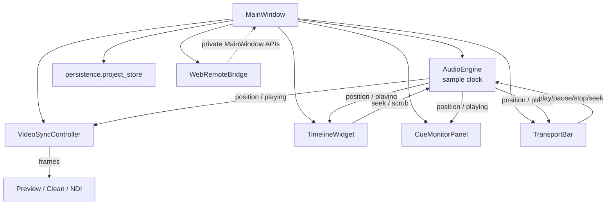
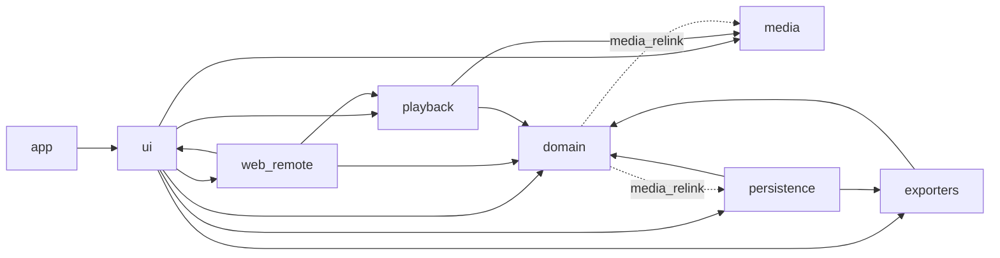
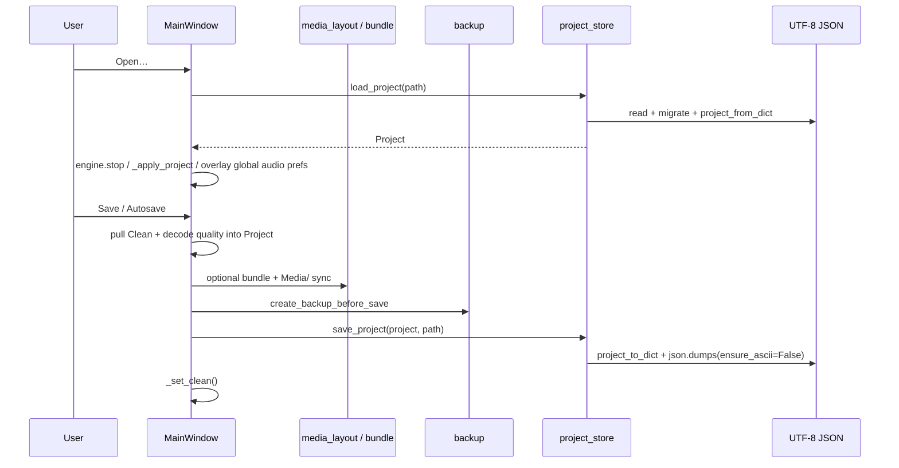
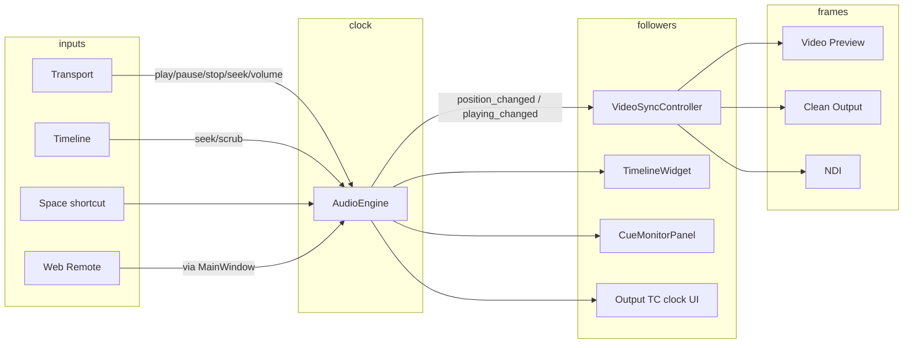

# CuePlayer — Current Architecture Assessment

**Status:** Sprint 2 · Task 7 complete (Settings service foundation)  
**Updated:** 2026-08-03  
**Scope tip:** `cursor/sprint2-settings-service-028d`  
**Constraint (Task 7):** Machine SettingsService only — preserve QSettings schema; no Project JSON in SettingsService; no AudioEngine/Timeline/Playback/RemoteHost redesign.

Related docs (do not treat as identical):

| Doc | Role |
|-----|------|
| [`ARCHITECTURE.md`](ARCHITECTURE.md) | Short aspirational layer diagram |
| [`ARCHITECTURE_REVIEW.md`](ARCHITECTURE_REVIEW.md) | Earlier as-built review (ZH); partially stale |
| [`ARCHITECTURE_TARGET.md`](ARCHITECTURE_TARGET.md) | Strangler target layout |
| [`BOUNDARY_RULES.md`](BOUNDARY_RULES.md) / [`MIGRATION_RULES.md`](MIGRATION_RULES.md) | Permanent law |
| [`SPRINT_0_REVIEW.md`](SPRINT_0_REVIEW.md) | Foundation retrospective |
| [`CHANGELOG.md`](../CHANGELOG.md) | Release / sprint notes |
| **This file** | Living English as-built snapshot |

---

## Sprint 1 Task 2 — Transitional cleanup (done)

| Action | Result |
|--------|--------|
| Unify `ports/` | Canonical `src/cueplayer/ports/*.py` + `tests/ports/test_ports_package.py` on this tip |
| Remove `ui.cue_list_columns` shim | Callers → `domain.cue_list_columns` only; shim file deleted |
| Remove dead `playback/clock.py` | Unused wall-clock `PlaybackClock` (name clash with `ports.clock.PlaybackClock`) |
| Remove empty `timeline/` / `ltc/` stubs | Real timeline UI under `ui/`; LTC under `timecode/` + `media/` |
| Drop `_AUDIO_SUFFIXES` alias | Use `AUDIO_SUFFIXES` from `ui.drag_drop` only |

**Not done in Task 2:** Service Layer, Repository pattern, RemoteHost wiring, adapters renames.

---

## Sprint 1 Task 3 — Application layer foundation (done)

| Action | Result |
|--------|--------|
| `application/project_service.py` | New/open/save/save-as helpers, dirty, autosave prefs, recent/last project |
| MainWindow | Delegates lifecycle state + I/O; keeps dialogs, media layout/bundle, engine stop, apply_project |
| Persistence | Unchanged (`load_project` / `save_project` / backup) |
| Recent projects | QSettings list (max 10) + legacy last-project key for session restore |

**Not done here:** Repository pattern, RemoteHost, other application services.

---

## Sprint 1 Task 4 — Repository layer foundation (done)

| Action | Result |
|--------|--------|
| `repository/project_repository.py` | `load` / `save` / `autosave` / `backup` / `exists` |
| `ProjectService` | Depends on repository only (no `persistence` imports) |
| Persistence | Unchanged; repository wraps existing functions |
| UI | Unchanged |

Dependency:

```text
MainWindow → ProjectService → ProjectRepository → persistence.project_store / backup
```

**Not done here:** PlaybackService, RemoteHost, generic repository framework.

---

## Sprint 2 Task 5 — Playback foundation (done)

| Piece | Role |
|-------|------|
| `domain/song_session.py` (`SongSession`) | Current song + playing / position / duration snapshot |
| `application/playback_service.py` (`PlaybackService`) | Play / Pause / Stop / Seek / Toggle → `AudioEngine` |
| MainWindow | Transport + Space wired to `PlaybackService`; `current_song` proxies session |

### Design contracts (Task 5)

**SongSession** — Current song + transport snapshot mirror.

**PlaybackService** — Play/Pause/Stop/Seek/Toggle → engine; sync session.

See Task 6 for expanded PlaybackService contract (volume/loop/scrub/nudge).

### Architecture before / after

```text
Before:
  MainWindow ──play/pause/stop/seek──► AudioEngine
  MainWindow.current_song (local field)

After:
  MainWindow ──► PlaybackService ──► AudioEngine  (sole sample clock)
                     │
                     └─ syncs ► SongSession (current song + transport snapshot)
  MainWindow.current_song ──property──► SongSession.song
```

**Deferred from Task 5 (done in Task 6):** volume / loop / scrub / nudge boundary.

---

## Sprint 2 Task 6 — Playback boundary completion (done)

| Piece | Role |
|-------|------|
| `PlaybackService` (extended) | Volume / mute / music gain / waveform gain; A–B loop; scrub begin/end; nudge |
| `SongSession` | Unchanged contract — transport read-model mirror only |
| MainWindow | No longer writes volume/loop/scrub/nudge to `AudioEngine` directly |
| `_activate_song` | Still in MainWindow (orchestration intentionally deferred) |

### Design decisions

| Decision | Responsibility | Non-responsibility | Dependency | Why |
|----------|----------------|--------------------|------------|-----|
| Volume/mute/gain on `PlaybackService` | Façade writes → engine | Not clip-local video volume UI state | `AudioEngine` | Same path as transport; UI must not touch mix gains |
| Loop mutations on `PlaybackService` | A/B/region/enable/clear + fresh-pair rule | Timeline paint / transport widgets | `AudioEngine` | Preserves engage/`_loop_engage` semantics without engine redesign |
| Scrub begin/end on `PlaybackService` | Pause-for-scrub / resume | VideoSync scrubbing flag (still UI) | `AudioEngine` | Engine owns scrub resume state |
| Nudge on `PlaybackService` | Frame-step seek | Hold-acceleration timing (still UI) | `AudioEngine` | Playback-related seek |
| Playback rate **not** extracted | — | Device `_playback_rate` stays inside engine | — | Not a MainWindow-owned pitch control; PortAudio negotiation only |
| `_activate_song` stays | — | Song load / buffer / timeline apply | MainWindow | Orchestration spans UI surfaces; separate future task |

### Playback dependency graph

```text
Before (Task 5):
  MainWindow ──transport──► PlaybackService ──► AudioEngine
  MainWindow ──volume/loop/scrub/nudge──► AudioEngine   (still direct)

After (Task 6):
  MainWindow ──transport/volume/loop/scrub/nudge──► PlaybackService ──► AudioEngine
  MainWindow ──_activate_song / buffer / device / LTC──► AudioEngine   (orchestration + I/O)
  SongSession ◄── sync (playing/position/duration) ── PlaybackService
```

**Not done here (Task 6):** ShowSessionService; RemoteHost mute path; sync-calib dialog engine mute; `_activate_song` extract.

---

## Sprint 2 Task 7 — Settings service foundation (done)

| Piece | Role |
|-------|------|
| `application/settings_service.py` | Machine prefs façade over `QSettings` + `audio_prefs` |
| MainWindow | Creates `SettingsService`; UI session / audio go through it; no longer owns raw QSettings construction for prefs |
| `ProjectService` | Still owns recent/autosave *orchestration*; uses SettingsService as `SettingsStore` |
| Project JSON | Untouched — must not enter SettingsService |

### Design decisions

| Decision | Responsibility | Non-responsibility | Dependency | Why |
|----------|----------------|--------------------|------------|-----|
| SettingsService owns machine QSettings | Org/app store + key constants | Project song/mark/setlist JSON | `QSettings` | Single machine-state owner |
| Audio via existing `audio_prefs` | load/save/apply overlay | Schema redesign; engine apply | `persistence.audio_prefs` | Identical schema + behavior |
| Window / chrome keys on service | Geometry, splitters, view mode, NOW/cue list | Widget layout logic | Same string keys as before | Move QSettings out of MainWindow without UI redesign |
| Theme = fixed `pitch_black` | Report theme id | Persisted theme switch (none exists) | `THEME_ID` constant | No schema to invent |
| Autosave / recent APIs on service | Raw machine keys | Existence filtering / open-save side effects | Shared keys with ProjectService | Machine vs project separation; ProjectService still orchestrates |
| Project state stays out | — | Never write show content to QSettings | — | Hard architecture rule |

### Settings flow (after Task 7)

```text
MainWindow → SettingsService → QSettings (CuePlayer/CuePlayer)
                 ├─ audio_prefs load/save/apply (machine audio)
                 ├─ ui/* / mainwindow/* / clean_output/* keys
                 ├─ autosave/* + session/recent|last keys (raw)
                 └─ theme_id() → "pitch_black" (code theme; no key)
MainWindow → ProjectService(SettingsService) → recent/autosave orchestration + ProjectRepository
Project JSON ← persistence (project state only)
```

**Still outside SettingsService (debt):** `web_remote.prefs`, `color_presets`, export dialog dirs, RemoteHost.

---

## 1. Current folder structure

```text
CuePlayer_didido/
├── AGENTS.md / README.md / CHANGELOG.md / pyproject.toml
├── .ai/                    # AI workflow: NEXT_TASK, REPORT, handoffs, prompts
├── .cursor/rules/          # auto-push, ai-workflow
├── docs/                   # architecture + product + distribution manuals
├── fixtures/               # MA2/MA3 golden XML, media, export fixtures
├── packaging/              # Windows PyInstaller / Inno (Windows-only builds)
├── scripts/
├── tests/                  # ~mirrors packages; ui tests dominate
└── src/cueplayer/          # ~107 .py packages (no empty timeline/ltc stubs)
    ├── app.py              # QApplication boot + MainWindow
    ├── __main__.py         # python -m cueplayer
    ├── domain/             # models, undo, cue id, columns, media_relink, song_session
    ├── application/        # ProjectService, PlaybackService, SettingsService
    ├── repository/         # ProjectRepository (file I/O façade)
    ├── ports/              # Protocol interfaces only (canonical)
    ├── playback/           # AudioEngine (clock), video sync/mix, devices, NDI, MTC/MIDI
    ├── media/              # decode, caches, BPM, LTC detect, av_path_lock
    ├── persistence/        # JSON project, bundle, backup, media layout, audio prefs
    ├── exporters/          # ma2/, ma3/, plan, show_patch, XML helpers
    ├── ui/                 # ~53% LOC — MainWindow hub + widgets/dialogs
    ├── web_remote/         # HTTP/WS server, bridge, static app.js
    ├── timecode/           # SMPTE / LTC / MTC helpers
    ├── routing/            # channel matrix
    ├── util/               # frozen runtime, thread priority
    └── spikes/             # early experiments
```

### LOC by package (approx., `.py` only)

| Package | LOC | Notes |
|---------|----:|-------|
| `ui/` | ~23.6k | Dominant; god-object `main_window` |
| `playback/` | ~5.8k | Clock + video audio + devices |
| `media/` | ~3.5k | Decode / caches / BPM |
| `web_remote/` | ~3.3k | Plus `static/app.js` ~3316 lines |
| `exporters/` | ~2.4k | Cleanest layer |
| `domain/` | ~2.2k | |
| `persistence/` | ~2.2k | |
| `timecode/` / others | small | |
| `ports/` | 0 → Protocols only | **Canonical** on tip after Task 2 |
| ~~`timeline/` / `ltc/`~~ | removed | Empty stubs deleted Task 2 |

---

## 2. Main entry points

| Entry | Path | Behavior |
|-------|------|----------|
| Module | `python -m cueplayer` → `__main__.py` | Calls `app.main()` |
| Package | `cueplayer.app:main` | Boot log, Qt app, splash, `MainWindow` |
| CLI side door | `cueplayer --bpm-detect …` | Headless BPM worker **before** full UI boot |
| Frozen EXE | Same `app.main` via packaging | Windows employee builds only |

Boot sequence (simplified):

```text
__main__ → app.main()
  ├─ [--bpm-detect] → media.bpm_analyzer.run_bpm_detect_cli → exit
  └─ QApplication + splash
        └─ MainWindow()          # composition root of nearly everything
              ├─ Project / Song
              ├─ AudioEngine
              ├─ VideoSyncController
              ├─ Timeline / Monitor / Transport / Setlist …
              └─ optional Web Remote bridge
```

There is **no** separate `application/` package yet. Composition and use-cases live inside `MainWindow`.

---

## 3. Major modules and their responsibilities

| Module | Intended job | As-built reality |
|--------|--------------|------------------|
| **domain** | Pure Project/Song/Mark rules | Mostly correct; `media_relink` reaches into media + persistence |
| **playback** | Sole sample clock + device I/O + TC outs + video audio mix | `AudioEngine` is wide; `clock.py` is a legacy wall-clock stub, not the master clock |
| **media** | Decode, waveform/PCM caches, BPM, LTC detect, PyAV lock | Clear; `av_path_lock` is a cross-cutting runtime contract |
| **persistence** | UTF-8 JSON + migrations + bundle/backup | Functional; still depends on exporters naming + (lazy) playback device default |
| **exporters** | Song → MA2/MA3 | Clean; UI constructs exporters directly |
| **ui** | Widgets | Also project lifecycle, media jobs, remote host, autosave orchestration |
| **web_remote** | LAN control | Package-local server/state; `bridge` duck-types `MainWindow` private APIs |
| **timecode / routing / util** | Helpers | Small and coherent |
| **ports** | Protocol seams | ✅ Present on tip; Protocols only — not wired yet |
| ~~**timeline/ / ltc/**~~ | — | Removed empty stubs (Task 2) |
### Runtime composition (as wired today)



---

## 4. Current dependency graph

Static first-party imports (package → package), measured on this tip:

```text
(root)/app     → ui, media, util
ui             → domain, exporters, media, persistence, playback, util, web_remote
web_remote     → domain, media, persistence, playback, timecode, ui, util
playback       → domain, media, routing, timecode, util
media          → domain, util
persistence    → domain, exporters, media, playback   (audio_prefs → devices default)
exporters      → domain
routing        → domain
domain         → media, persistence                   (media_relink only)
spikes         → routing
```



### Boundary status vs `BOUNDARY_RULES.md`

| Edge | Status on this tip |
|------|--------------------|
| `persistence → ui` | **Cleared** (Sprint 0): uses `domain.cue_list_columns` |
| `domain → media/persistence` | Still present via `domain.media_relink` |
| `web_remote → MainWindow` privates | Still present (duck-typed; no hard import of `main_window`) |
| `ports` package | ✅ Present — Protocols only; not yet adopted by bridge |
| `cue_list_columns` | ✅ Single path: `domain.cue_list_columns` (UI shim removed) |
Non-UI importers of `cueplayer.ui.*`: only `app` (boot) and `web_remote.dialog` (`ui.checkbox`).

---

## 5. Largest files (top 10 by size)

By **line count** (`.py` / notable JS). Byte size order is the same for the giants.

| # | Lines | Path |
|--:|------:|------|
| 1 | 7637 | `ui/main_window.py` |
| 2 | 4507 | `ui/timeline_widget.py` |
| 3 | 3316 | `web_remote/static/app.js` |
| 4 | 2688 | `ui/cue_monitor_panel.py` |
| 5 | 2146 | `playback/audio_engine.py` |
| 6 | 1338 | `web_remote/bridge.py` |
| 7 | 1323 | `ui/mark_manager_dialog.py` |
| 8 | 1080 | `domain/models.py` |
| 9 | 989 | `media/bpm_analyzer.py` |
| 10 | 870 | `persistence/project_store.py` |

Honorable mentions: `setlist_sheet_page.py` (~819), `show_patch_page.py` (~737), `transport_bar.py` (~734), `web_remote/state.py` (~780).

---

## 6. Which files contain business logic mixed with UI

Not every domain import in UI is a smell (binding models to widgets is normal). The problem is **orchestration / rules / side effects** living in widgets.

| File | Mixed responsibilities (examples) |
|------|-----------------------------------|
| **`ui/main_window.py`** | Open/save/autosave/bundle/relink; song activate + audio prefetch; BPM/LTC job scheduling; undo push; MA name sync; setlist renumber; Clean/NDI toggles; Web Remote host; dirty tracking |
| **`ui/timeline_widget.py`** | Paint + zoom/scroll + mark/clip edit gestures + scrub + waveform cache ownership + cue-id helpers |
| **`ui/cue_monitor_panel.py`** | Cue table UX + column prefs + NOW chrome + renumber menu wiring + note/id edits |
| **`ui/setlist_sheet_page.py`** | Sheet UX + mutates `song.ma_export_name` via exporter naming rules |
| **`ui/song_edit_dialog.py`** | Form UX + MA export name suggestion |
| **`ui/mark_manager_dialog.py`** | Lane CRUD UI + `sync_lane_cue_ids` |
| **`ui/show_patch_page.py`** | Export plan UI + MA sanitize |
| **`ui/missing_media_dialog.py`** | Relink UX over domain `media_relink` (acceptable thin; domain still impure) |
| **`web_remote/bridge.py`** | Not Qt widgets, but **application service** duplicated against MainWindow private surface |

Pure-ish UI (theme, checkbox, icon button, spinboxes, row_color) is comparatively clean.

---

## 7. Circular imports (if any)

### Package-level

No hard package cycles such as `playback ↔ ui`. Soft/forbidden-ish edges: `domain → media/persistence`, `web_remote → ui` (dialog only).

### Module-level

| Pair | Nature |
|------|--------|
| `domain.models` ↔ `domain.main_cue_id` | **Real soft cycle:** `main_cue_id` imports models; `Song` methods lazily import `main_cue_id` inside methods. Works at runtime; awkward for typing/tools. |
| `timecode` package `__init__` ↔ `timecode.ltc` / `mtc` | Benign re-export pattern (submodules import `smpte`, package imports submodules). |
| `playback.audio_engine` → `midi_cue_notes` | One-way only (false positive if treating attribute names as imports). |

**Verdict:** No import-time deadlock found in normal UI boot. The only worth-tracking cycle is **models ↔ main_cue_id**.

---

## 8. Global state usage

CuePlayer avoids classic process-wide singletons for `Project` / `Song`, but has several **process-scoped** stores:

| Mechanism | Where | Role |
|-----------|-------|------|
| **`av_path_lock` registry** | `media/av_lock.py` (`_locks` dict) | Per-resolved-path `RLock` for PyAV; shared by preview, scrub, waveform, mixer, stand-in |
| **QSettings (`CuePlayer`/`CuePlayer`)** | `SettingsService` (+ `audio_prefs`, `web_remote/prefs`, `color_presets`) | Machine-global prefs |
| **Disk audio cache** | `media/audio_disk_cache` (+ MainWindow in-memory maps) | Cross-song PCM/waveform reuse |
| **Thread pools / tokens** | `MainWindow` | Load/BPM/LTC generation counters (`_audio_load_token`, `_song_activate_gen`, …) |
| **Shared mutable `Song` / `Project`** | Engine, video_sync, timeline, monitor, remote | Not a Python `global`, but **shared object identity** is the real global state |

There is no DI container; `MainWindow` owns references.

---

## 9. Existing models

Primary home: `domain/models.py` (+ helpers in sibling modules).

| Type / area | Location | Notes |
|-------------|----------|-------|
| `Project` | `models.py` | Setlist, songs, categories, audio/clean/MA settings, UI chrome prefs persisted in JSON |
| `Song` | `models.py` | Timebase, audio tracks, video clips, mark lanes, LTC sides, BPM, setlist fields |
| `AudioTrack`, `VideoClip`, `Mark`, `MarkLane` | `models.py` | Core timeline entities |
| `SetlistCategory` | `models.py` | Folders |
| `MaExportSettings`, `AudioOutputSettings`, `CleanVideoOutputSettings` | `models.py` | Nested settings objects |
| Cue list column constants | `domain/cue_list_columns.py` | **Only** supported path (UI shim removed Task 2) |
| Cue ID rules | `domain/main_cue_id.py` | Assign/renumber/sort |
| Undo commands | `domain/undo.py` | Command objects over Project/Song |
| Relink scan helpers | `domain/media_relink.py` | Domain-named but reaches media/persistence |

Schema version constant lives with models (`SCHEMA_VERSION`); migrations live in `persistence/project_store.py`.

---

## 10. Existing services

| Service | Home | Notes |
|---------|------|-------|
| **`ProjectService`** | `application/project_service.py` | Lifecycle; I/O via `ProjectRepository` |
| **`PlaybackService`** | `application/playback_service.py` | ✅ Transport + volume/loop/scrub/nudge → AudioEngine |
| **`SettingsService`** | `application/settings_service.py` | ✅ Machine QSettings + audio_prefs façade |
| **`SongSession`** | `domain/song_session.py` | ✅ Current song + transport snapshot (mirror) |
| Song activate orchestration | `MainWindow._activate_song` | Still UI-owned (timeline/video/monitor refresh) |
| Media job queue | `MainWindow` executors | Still UI-owned |
| Video output fan-out | `MainWindow` + `VideoSyncController` | Still UI-owned |
| Export orchestration | UI + `exporters/*` | |
| Remote command surface | `web_remote.bridge` | RemoteHost port unused |
| Playback clock / mix | `AudioEngine` | Unchanged internals |
| Frame clock follower | `VideoSyncController` | |

`MainWindow` still owns dialogs, media layout/bundle, song-activate refresh order, and applying a loaded `Project` to widgets.

---

## 11. Existing repositories

| Repository | Home | Notes |
|------------|------|-------|
| **`ProjectRepository`** | `repository/project_repository.py` | ✅ Task 4 — `load`/`save`/`autosave`/`backup`/`exists` |

Internally calls unchanged `persistence.project_store` + `persistence.backup`. No generic repository base class.

Other persistence remains function-oriented (`project_bundle`, `media_layout`, `audio_prefs`, …) until later tasks.

---

## 12. Current save/load flow



Notes:

- Dirty flag `_dirty` is owned by `MainWindow` (not domain).
- Autosave: QTimer + QSettings interval; quiet `_file_save`.
- Load path also used by “Collect Bundle” then reopen bundled JSON.
- Missing media: after open, relink dialog via `domain.media_relink.scan_missing_media`.
- Machine audio prefs from QSettings **overlay** project JSON on apply (`apply_global_audio_to_project`).

---

## 13. Current playback flow



Rules in force:

- **`AudioEngine.position` (sample-based) is the only playback clock.**
- Video windows share one decode path through `VideoSyncController` (not a second player).
- Song switch: `quiesce_output` → swap `current_song` → `set_song` on timeline/monitor/sync/engine → async audio load under `av_path_lock` discipline.
- Embedded video audio mixes in `VideoAudioMixer` inside/ beside the engine path.

---

## 14. Current settings flow

Settings are split across **machine** vs **project** stores:

```text
┌─────────────────────────────┐
│ Project JSON (per show)     │  marks, songs, MA export, clean geometry,
│ persistence.project_store   │  decode quality, many chrome flags, etc.
└─────────────┬───────────────┘
              │ load overlays ↓
┌─────────────▼───────────────┐
│ SettingsService             │
│ → QSettings CuePlayer/…     │
│ • audio/output_settings_json│  ← audio_prefs (wins over project on apply)
│ • autosave/*                │  ← machine prefs (also used by ProjectService)
│ • UI session / monitor cols │  ← MainWindow via SettingsService
│ (not yet): web remote,      │  ← still web_remote.prefs / color_presets
│            color presets    │
└─────────────────────────────┘
              │
┌─────────────▼───────────────┐
│ Live widgets                 │
│ Audio Timecode dialog,       │
│ Transport, Clean window, …   │
│ mutate Project and/or machine│
│ prefs via SettingsService    │
└─────────────────────────────┘
```

Machine State and Project State must remain separate — SettingsService never owns Project JSON.

---

## 15. Technical debt (prioritized)

### Cleared in Sprint 1 Task 2

- Split tip / missing `ports/` sources  
- `ui.cue_list_columns` shim + dual import paths  
- Empty `timeline/` / `ltc/` stubs  
- Dead `playback.clock.PlaybackClock` wall-clock  
- Unused `_AUDIO_SUFFIXES` re-export alias on `MainWindow`

### P0 — Next (Event bus / Remote)

1. **No app-wide Event Bus** — UI still wires many Qt signals directly; next candidate: Event Bus foundation.
2. **`WebRemoteBridge` ↔ MainWindow private API** — `ports.RemoteHost` exists but is unused.
3. **`_activate_song` still a large MainWindow orchestrator** — further song-session Protocol adoption later.
4. **Machine prefs still also in `web_remote.prefs` / `color_presets` / export dialog** — fold into SettingsService later if needed.

### P1 — Structural risk (product-visible)

4. **`MainWindow` god-object (~7.6k)** — composition + use-cases.
5. **Shared mutable `Song`** — missed refresh → A/V or list desync.
6. **`av_path_lock` contention** — preview/scrub/waveform/mixer share path locks.
7. **`AudioEngine` breadth** — device + routing + LTC/MTC/MIDI + video audio in one type.

### P2 — Layering / maintainability

8. **`domain.media_relink` → media/persistence** — violates target domain purity.
9. **`persistence` → `exporters.common` naming** — storage coupled to MA sanitize rules.
10. **`models` ↔ `main_cue_id` soft cycle**.
11. **Giant UI files** (`timeline_widget`, `cue_monitor_panel`).
12. **No repository classes** (intentional until a later sprint; functions in `persistence/` are fine).

### P3 — Deferred

13. Full `adapters/` tree rename of playback/media.
14. Rewriting `AudioEngine` / timeline paint architecture.
15. Product features under an “architecture” banner.

---

## Documentation merge / simplify notes

Sprint 1 should **not** delete history blindly, but can reduce agent confusion:

| Action | Recommendation |
|--------|----------------|
| Keep **this file** | Sprint 1 baseline “what is true on trunk after unify” |
| Banner on `ARCHITECTURE_REVIEW.md` | “Superseded for English baseline by `current_architecture.md`; ZH narrative retained” |
| Slim `ARCHITECTURE.md` | Point to current + target + boundary; drop duplicated long prose |
| Do **not** merge BOUNDARY/MIGRATION into review docs | Law docs should stay short and permanent |
| Fix `PRODUCT_SPEC` status header | Separate tiny docs chore |

---

# Sprint plan status

| Task | Status | Notes |
|------|--------|-------|
| Sprint 1 · 1–4 | ✅ Done | Assessment → cleanup → ProjectService → ProjectRepository |
| **Sprint 2 · 5** Playback foundation | ✅ Done | PlaybackService + SongSession |
| **Sprint 2 · 6** Playback boundary | ✅ Done | Volume / loop / scrub / nudge via service |
| **Sprint 2 · 7** Settings service | ✅ Done | Machine SettingsService + QSettings façade |
| **Sprint 2 · 8** Event Bus foundation | **Next** | Decouple UI signal fan-out |

### Recommended Sprint 2 Task 8 — Event Bus foundation

- Introduce a thin in-process event bus / application events for high-value MainWindow fan-out (playhead, song activate, dirty) without redesigning Qt widgets.
- Do not replace AudioEngine clock signals in the same task.
- Keep behavior identical; strangler only.

### Risks for Task 8

| Risk | Mitigation |
|------|------------|
| Double-delivery if both bus and direct signals fire | Migrate one fan-out at a time |
| Clock vs UI events mixed | Bus carries UI/domain events only; AudioEngine remains clock |

---

## READY FOR EVENT BUS FOUNDATION
